# Next.js 15+ Learning Guide: RSC, Server Actions & UI Diffs

## 📚 Complete Learning Resource

This document explains the three core concepts demonstrated in the EduShop app.

---

## Quick Concepts Overview 🎯

This project demonstrates **9 core Next.js concepts** working together:

| # | Concept | What It Does | Where | Priority |
|---|---------|------------|-------|----------|
| 1️⃣ | **React Server Components (RSC)** | Components that run on server, fetch data securely | `src/lib/products.ts` | ⭐⭐⭐ Essential |
| 2️⃣ | **Server Actions** | Mutations without API routes, callable from client | `src/lib/actions.ts` | ⭐⭐⭐ Essential |
| 3️⃣ | **Client Components** | Browser-based React with hooks and events | `src/components/SearchBar.tsx` | ⭐⭐⭐ Essential |
| 4️⃣ | **UI Diffs & State** | React efficiently updates UI based on state changes | `src/components/SearchBar.tsx` | ⭐⭐ Important |
| 5️⃣ | **Suspense & Streaming** | Progressive rendering, components load independently | `src/app/page.tsx` | ⭐⭐ Important |
| 6️⃣ | **App Router** | File-based routing, nested layouts, route groups | `src/app/` folder | ⭐⭐ Important |
| 7️⃣ | **TypeScript** | Full type safety across client-server boundary | `src/types/` | ⭐ Nice to have |
| 8️⃣ | **Tailwind CSS** | Utility-first styling framework | Throughout | ⭐ Nice to have |
| 9️⃣ | **Next.js Features** | Metadata API, image optimization, code splitting | Throughout | ⭐ Nice to have |

### The Three Core Concepts (Deep Dive)

**📖 Read these sections in this order:**
1. **Section 0: Foundations** - How server/client code separation works
2. **Section 1: RSC** - Server-side data fetching
3. **Section 2: Server Actions** - Server mutations from client
4. **Section 3: UI Diffs & Streaming** - Reactive UI updates
5. **Integration** - How they work together
6. **Architecture Overview** - Visual diagrams and decision trees

### How This Guide Flows

The first three sections build your mental model of how Next.js separates concerns. Then, Sections 4-6 show you the **production patterns** you'll use every day: handling errors, capturing forms, and validating data. Finally, we tie everything together with architecture diagrams and decision trees.

---

## 0. Foundations: How Next.js Separates Server & Client Code 🏗️

### The Key Concept

In Next.js, **server code and React code are NOT completely separate** — they're **mixed in the same folder but distinguished by directives**. This is the revolutionary part of modern Next.js!

```
src/
├── lib/
│   ├── products.ts        ← Server only (no directive)
│   └── actions.ts         ← "use server" directive
└── components/
    ├── SearchBar.tsx      ← "use client" directive
    └── ProductCard.tsx    ← Server by default
```

### The Directive System

Next.js uses **simple text directives** to tell the compiler where code runs:

| Directive | Where | DB Access? | Browser JS? | Use For |
|-----------|-------|-----------|-----------|---------|
| `None` (default) | Server | ✅ Yes | ❌ No | Data fetching, Server Components |
| `"use server"` | Server | ✅ Yes | ❌ No | Mutations, Server Actions |
| `"use client"` | Browser | ❌ No | ✅ Yes | UI state, events, interactivity |

### Real Examples from Your EduShop

**Server Component** (default - no directive):
```typescript
// src/lib/products.ts - runs on server only
export async function getAllProducts(): Promise<Product[]> {
  return PRODUCTS; // Safe to access any data
}
```

**Server Action** (`"use server"`):
```typescript
// src/lib/actions.ts
"use server";

export async function searchProducts(query: string) {
  const allProducts = await getAllProducts(); // Can call server functions!
  return allProducts.filter(/*...*/);
}
```

**Client Component** (`"use client"`):
```typescript
// src/components/SearchBar.tsx
"use client";

export function SearchBar() {
  const [query, setQuery] = useState(""); // React hooks here!
  const results = await searchProducts(query); // Calls server action
  return <input onChange={handleSearch} />; // Browser events
}
```

### How the `.next` Folder Works

When you run `npm run build`:

1. **Next.js reads all your source files** in `src/`
2. **Analyzes directives** to determine what runs where
3. **Creates two separate bundles:**
   - **Server bundle** (`.next/server/`) - all functions marked `"use server"` + RSC functions
   - **Client bundle** (`.next/static/`) - only code with `"use client"` 
4. **Secrets stay safe** - anything server-side never reaches the browser

### Quick Mental Model

Think of it like:
- **`src/` = Your source code** (mixed server & client)
- **`.next/server/` = Server JavaScript** (runs on your Node.js server)
- **`.next/static/` = Client JavaScript** (runs in user's browser)
- **The directive (`"use server"`, `"use client"`) = The router** that decides where each file goes

---

## 1. React Server Components (RSC) 🖥️

### What Are They?

React Server Components are React components that **run exclusively on the server**. They're the default in Next.js App Router.

```typescript
// This is a Server Component (default)
export default async function ProductList() {
  const products = await fetch('database...'); // Secure DB query
  return <div>{/* render products */}</div>;
}
```

### Key Characteristics

| Feature | Description |
|---------|-------------|
| **Execution** | Runs only on the server, never in the browser |
| **JavaScript** | Zero JavaScript sent to browser for this component |
| **Database Access** | Can directly query databases |
| **Secrets** | API keys, tokens never exposed to client |
| **Bundle Size** | Reduces client-side JavaScript significantly |
| **Async/Await** | Can use async operations directly |
| **No Hooks** | Cannot use useState, useEffect, useContext, etc. |

### Real Examples in EduShop

**File: `src/lib/products.ts`**
```typescript
// RSC function - runs on server only
export async function getAllProducts(): Promise<Product[]> {
  await delay(500); // Simulate database query
  return PRODUCTS; // Directly return data
}
```

**File: `src/components/CategoryBrowser.tsx`**
```typescript
// RSC component - no "use client" needed
export async function CategoryBrowser() {
  // This is a Server Component
  const categories = await getCategories(); // Runs on server
  
  return (
    <div>
      {categories.map(category => (
        <CategorySection key={category} categoryName={category} />
      ))}
    </div>
  );
}

// Nested RSC
async function CategorySection({ categoryName }: { categoryName: string }) {
  const products = await getProductsByCategory(categoryName); // Server DB query
  
  return (
    <section>
      {products.map(product => (
        <ProductCard key={product.id} product={product} />
      ))}
    </section>
  );
}
```

### Data Flow

#### Text Diagram
```
┌─────────────────────────────────────────┐
│      User visits /products              │
└──────────────┬──────────────────────────┘
               │
               ▼
┌─────────────────────────────────────────┐
│  CategoryBrowser RSC executes            │
│  (on server, before HTTP response)       │
└──────────────┬──────────────────────────┘
               │
               ▼
┌─────────────────────────────────────────┐
│  CategoryBrowser calls getCategories()   │
│  Database query runs on SERVER           │
│  No network request from browser!        │
└──────────────┬──────────────────────────┘
               │
               ▼
┌─────────────────────────────────────────┐
│  React renders CategoryBrowser to HTML   │
│  on the server                           │
└──────────────┬──────────────────────────┘
               │
               ▼
┌─────────────────────────────────────────┐
│  HTML is sent to browser                 │
│  (with NO JavaScript for data fetch)     │
└──────────────┬──────────────────────────┘
               │
               ▼
┌─────────────────────────────────────────┐
│  Browser displays HTML instantly         │
│  Content is interactive immediately      │
└─────────────────────────────────────────┘
```

#### Architecture Diagram (Mermaid)
```mermaid
graph TD
    A["🚀 User Visits /products"] --> B["🖥️ Server Receives Request"]
    B --> C["⚙️ CategoryBrowser RSC Executes"]
    C --> D["🔍 Call getCategories Function"]
    D --> E["💾 Query Database<br/>No client-side JS needed!"]
    E --> F["📝 React Renders to HTML<br/>on Server"]
    F --> G["📤 HTML Response Sent<br/>Zero extra JavaScript"]
    G --> H["🌐 Browser Receives HTML"]
    H --> I["✅ User Sees Content<br/>Instantly Interactive"]
    
    style A fill:#e1f5ff
    style B fill:#fff3e0
    style C fill:#f3e5f5
    style D fill:#f3e5f5
    style E fill:#e8f5e9
    style F fill:#f3e5f5
    style G fill:#fff3e0
    style H fill:#e1f5ff
    style I fill:#c8e6c9
```

### Benefits Summarized

1. **Security**: Database queries never exposed to client
2. **Performance**: Data fetching doesn't require client-side JavaScript
3. **Bundle Size**: Less code shipped to browser
4. **Always Fresh**: Each page request fetches latest data
5. **SEO Friendly**: All content rendered to HTML server-side

### Key Takeaway: RSC is Your Data Layer

Think of RSC as a **secure, zero-JavaScript data layer**. Users see content instantly because data fetching happens server-side before HTML is sent. This is the foundation everything else builds on.

---

## 2. Server Actions ⚡

### What Are They?

Server Actions are asynchronous functions that run on the server and can be called from Client Components. They're marked with the `"use server"` directive.

```typescript
"use server"; // Marks this as server code

export async function addToCart(productId: string, quantity: number) {
  // This function runs on the server when called from client
  const product = await getProductById(productId);
  // Validate, update database, etc.
  return { success: true, product };
}
```

### Key Characteristics

| Feature | Description |
|---------|-------------|
| **Directive** | Marked with `"use server"` at file/function level |
| **Callable From** | Client Components, Server Components, forms |
| **Security** | Runs on server, secrets stay safe |
| **No API** | No need to create `/api/` routes |
| **Serialization** | Automatic data serialization |
| **Type Safety** | Full TypeScript support |
| **Form Integration** | Works with HTML `<form>` action prop |

### Real Examples in EduShop

**File: `src/lib/actions.ts`**
```typescript
"use server"; // All functions in this file are Server Actions

// Server Action 1: Search products
export async function searchProducts(query: string): Promise<Product[]> {
  await new Promise((resolve) => setTimeout(resolve, 300)); // Simulate DB delay
  
  const allProducts = await getAllProducts();
  
  const searchTerm = query.toLowerCase();
  return allProducts.filter(
    (product) =>
      product.name.toLowerCase().includes(searchTerm) ||
      product.description.toLowerCase().includes(searchTerm)
  );
}

// Server Action 2: Add to cart (with validation)
export async function addToCart(productId: string, quantity: number) {
  const allProducts = await getAllProducts();
  const product = allProducts.find((p) => p.id === productId);

  if (!product) {
    throw new Error("Product not found");
  }

  if (!product.inStock) {
    throw new Error("Product is out of stock");
  }

  // In real app: Save to database here
  return {
    success: true,
    message: `Added ${quantity} x ${product.name} to cart`,
    product,
    quantity,
  };
}
```

**File: `src/components/AddToCartButton.tsx`**
```typescript
"use client"; // This is a Client Component

import { addToCart } from "@/lib/actions"; // Import Server Action
import { useState } from "react";

export function AddToCartButton({ productId }: { productId: string }) {
  const [quantity, setQuantity] = useState(1);
  const [loading, setLoading] = useState(false);
  const [message, setMessage] = useState("");

  async function handleAddToCart() {
    setLoading(true);
    
    try {
      // Call Server Action directly from client
      const result = await addToCart(productId, quantity);
      setMessage(result.message);
    } catch (error) {
      setMessage("Error: " + error.message);
    } finally {
      setLoading(false);
    }
  }

  return (
    <div>
      <input
        type="number"
        value={quantity}
        onChange={(e) => setQuantity(parseInt(e.target.value))}
      />
      <button onClick={handleAddToCart} disabled={loading}>
        {loading ? "Adding..." : "Add to Cart"}
      </button>
      {message && <p>{message}</p>}
    </div>
  );
}
```

### Data Flow

#### Text Diagram
```
┌─────────────────────────────────────────┐
│  User clicks "Add to Cart" button        │
│  (in AddToCartButton Client Component)   │
└──────────────┬──────────────────────────┘
               │
               ▼
┌─────────────────────────────────────────┐
│  onClick handler calls addToCart()       │
│  (imported from src/lib/actions.ts)      │
└──────────────┬──────────────────────────┘
               │
               ▼
┌─────────────────────────────────────────┐
│  Next.js intercepts the call             │
│  Serializes arguments (JSON)             │
│  Sends to server via HTTP POST           │
└──────────────┬──────────────────────────┘
               │
               ▼
┌─────────────────────────────────────────┐
│  Server Action executes on SERVER        │
│  - Validates product exists              │
│  - Checks inventory                      │
│  - Saves to database                     │
│  - Returns result                        │
└──────────────┬──────────────────────────┘
               │
               ▼
┌─────────────────────────────────────────┐
│  Result serialized back to client        │
│  Returns as Promise in client code       │
└──────────────┬──────────────────────────┘
               │
               ▼
┌─────────────────────────────────────────┐
│  Client component receives result        │
│  Updates state (setMessage, etc.)        │
│  React re-renders with new state         │
└──────────────┬──────────────────────────┘
               │
               ▼
┌─────────────────────────────────────────┐
│  User sees success/error message         │
│  UI updates without page reload          │
└─────────────────────────────────────────┘
```

#### Sequence Diagram (Mermaid)
```mermaid
sequenceDiagram
    participant Browser as 🌐 Browser
    participant Client as 💻 Client Component<br/>AddToCartButton
    participant NextJS as ⚡ Next.js
    participant Server as 🖥️ Server
    participant DB as 💾 Database
    
    Browser->>Client: Click "Add to Cart"
    Client->>Client: quantity = 2
    Client->>Client: loading = true
    Client->>NextJS: addToCart(productId, 2)
    NextJS->>NextJS: Serialize arguments
    NextJS->>Server: HTTP POST /api/actions<br/>{productId, quantity}
    
    Server->>Server: Extract Server Action
    Server->>DB: getProductById(productId)
    DB-->>Server: product data
    Server->>Server: Validate product exists
    Server->>Server: Check if inStock = true
    Server->>DB: Save cart item
    DB-->>Server: Confirmed
    Server->>Server: Prepare response
    Server-->>NextJS: {success: true, message: "Added to cart"}
    
    NextJS->>NextJS: Deserialize response
    NextJS-->>Client: Promise resolves
    Client->>Client: loading = false
    Client->>Client: message = "Added to cart"
    Client->>Browser: Re-render with toast
    Browser->>Browser: Show ✓ Success message
    
    rect rgb(200, 230, 201)
    Note over Browser,DB: Result: User sees success feedback instantly
    end
```

### Using Server Actions with Forms

Server Actions shine with HTML forms:

```typescript
"use client";

import { submitContactForm } from "@/lib/actions";

export function ContactForm() {
  return (
    <form action={submitContactForm}>
      <input name="email" type="email" required />
      <input name="message" type="text" required />
      <button type="submit">Send Message</button>
    </form>
  );
}
```

Server Action:
```typescript
"use server";

export async function submitContactForm(formData: FormData) {
  const email = formData.get("email");
  const message = formData.get("message");
  
  // Save to database, send email, etc.
  
  // Revalidate page to show new message
  revalidatePath("/contact");
}
```

### Benefits Summarized

1. **No API Routes**: Forget about creating `/api/` endpoints
2. **Type Safe**: Full TypeScript inference across client-server boundary
3. **Secure**: Can safely access databases and private APIs
4. **Automatic Serialization**: Complex objects work automatically
5. **Progressive Enhancement**: Works even if JavaScript fails

### Key Takeaway: Server Actions are Your Mutation Layer

Server Actions let **client components safely modify data** without creating API routes. When a user interacts with your app, Server Actions handle the heavy lifting on the server side. Combined with RSC, you now have both reading (RSC) and writing (Server Actions) covered.

---

## 3. UI Diffs & Streaming 🎨

### What Are They?

UI Diffs refer to how React updates the UI when state changes. In Next.js, Streaming and Suspense allow different parts of a page to load and update independently.

### Key Concepts

#### State-Based UI Changes

```typescript
"use client";

import { useState } from "react";

export function SearchResults() {
  const [query, setQuery] = useState("");
  const [results, setResults] = useState([]);
  const [loading, setLoading] = useState(false);

  async function handleSearch(e) {
    const searchQuery = e.target.value;
    setQuery(searchQuery);
    
    if (!searchQuery) {
      setResults([]);
      return;
    }
    
    setLoading(true);
    const results = await searchProducts(searchQuery);
    setResults(results);
    setLoading(false);
  }

  // Different UI based on state
  return (
    <div>
      <input onChange={handleSearch} />
      
      {/* UI DIFF 1: Show loading while fetching */}
      {loading && <p>Searching...</p>}
      
      {/* UI DIFF 2: Show results when ready */}
      {results.length > 0 && (
        <div>
          Found {results.length} products
          {results.map(product => (
            <div key={product.id}>{product.name}</div>
          ))}
        </div>
      )}
      
      {/* UI DIFF 3: Show empty state */}
      {!loading && results.length === 0 && query && (
        <p>No products found for "{query}"</p>
      )}
    </div>
  );
}
```

### Streaming with Suspense

Streaming allows parts of your page to render and be sent to the browser independently:

```typescript
// src/app/page.tsx (Server Component)
import { Suspense } from "react";
import { CategoryBrowser } from "@/components/CategoryBrowser";

export default function Home() {
  return (
    <div>
      {/* This renders immediately */}
      <h1>Welcome to EduShop</h1>
      
      {/* This has a fallback while loading */}
      <Suspense fallback={<div>Loading categories...</div>}>
        <CategoryBrowser />
      </Suspense>
    </div>
  );
}
```

**What happens:**

```
1. Browser loads page
2. Gets HTML for <h1> immediately
3. Gets loading fallback: "Loading categories..."
4. Browser shows: "Welcome to EduShop" + "Loading categories..."
5. Server finishes fetching categories
6. Streams actual category HTML to browser
7. Browser replaces loading fallback with real content
8. User sees final page fully loaded
```

### Real Example in EduShop

**File: `src/app/page.tsx`**
```typescript
import { Suspense } from "react";
import { CategoryBrowser } from "@/components/CategoryBrowser";

export default function Home() {
  return (
    <div className="space-y-12 py-8">
      {/* Section 1: Hero - renders immediately */}
      <section>
        <h1>Welcome to EduShop</h1>
        <p>Learn Next.js 15+ patterns</p>
      </section>

      {/* Section 2: Search - Client Component, renders immediately */}
      <section>
        <SearchBar />
      </section>

      {/* Section 3: Categories - RSC with Suspense boundary */}
      <section>
        <h2>Browse by Category</h2>
        
        <Suspense fallback={<LoadingSkeletons />}>
          <CategoryBrowser /> {/* Fetches products here */}
        </Suspense>
      </section>
    </div>
  );
}
```

### Rendering Timeline

```
Time 0ms:   Browser requests /
Time 50ms:  Server sends HTML for hero section
Time 100ms: Browser shows hero section
Time 150ms: Server still fetching categories (Suspense fallback being shown)
Time 200ms: Browser shows loading skeleton
Time 500ms: Server finishes fetching categories from "database"
Time 550ms: Server sends category HTML to browser
Time 600ms: Browser replaces loading skeleton with categories
Time 650ms: User sees complete page
```

**Key Benefit**: User sees content progressively instead of waiting for the slowest component.

### Search Component - UI Diffs Example

**File: `src/components/SearchBar.tsx`**
```typescript
"use client";

import { useState } from "react";
import { searchProducts } from "@/lib/actions";

export function SearchBar() {
  const [query, setQuery] = useState("");
  const [results, setResults] = useState([]);
  const [loading, setLoading] = useState(false);
  const [searched, setSearched] = useState(false);

  async function handleSearch(e) {
    const searchQuery = e.target.value;
    setQuery(searchQuery);

    if (searchQuery.trim() === "") {
      setResults([]);
      setSearched(false);
      return;
    }

    setLoading(true);
    setSearched(true);

    try {
      const searchResults = await searchProducts(searchQuery);
      setResults(searchResults);
    } finally {
      setLoading(false);
    }
  }

  return (
    <div>
      <input
        type="text"
        placeholder="Search products..."
        value={query}
        onChange={handleSearch}
      />

      {/* 4 Different UIs rendered based on state */}
      
      {/* State 1: Not searched yet */}
      {!searched && <p>Start typing to search...</p>}

      {/* State 2: Searching (loading) */}
      {loading && <p>⟳ Searching...</p>}

      {/* State 3: Found results */}
      {!loading && searched && results.length > 0 && (
        <div>
          <p>Found {results.length} products</p>
          {results.map(product => (
            <ProductCard key={product.id} product={product} />
          ))}
        </div>
      )}

      {/* State 4: No results */}
      {!loading && searched && results.length === 0 && (
        <p>No products found for "{query}"</p>
      )}
    </div>
  );
}
```

**How React optimizes these diffs:**

1. When `query` changes → Re-render input (efficient)
2. When `loading` becomes true → Re-render loading message (efficient)
3. When `results` updates → Reconcile product list (only updates changed items)
4. React only updates the DOM nodes that changed

---

## 🔗 Integration: How RSC, Server Actions & UI Diffs Work Together

### Complete Flow Example: Product Search

#### Text Diagram
```
User types in search box
         │
         ▼
SearchBar component (Client) updates state
         │
         ▼
Input renders with new query value
         │
         ▼
onChange handler calls searchProducts() Server Action
         │
         ▼
State: loading = true
Component re-renders with loading message
         │
         ▼
Server Action runs on server:
- Gets all products (RSC function)
- Filters by search query
- Returns matching products
         │
         ▼
State: loading = false, results = [products]
Component re-renders with results
         │
         ▼
User sees matching products
```

#### Architecture Diagram (Mermaid)
```mermaid
graph LR
    A["🔍 User Types<br/>Search Query"] -->|onChange event| B["🎨 Client State<br/>query = 'headphones'"]
    B -->|UI Update| C["🎨 Render Input<br/>with new value"]
    C -->|Call Server Action| D["⚡ searchProducts<br/>Server Action"]
    D -->|Execute on Server| E["🖥️ Server<br/>Filters products"]
    E -->|Access Data| F["💾 Products Data<br/>In-memory/Database"]
    F -->|Return Results| G["📦 Response<br/>[Headphones, Earbuds]"]
    G -->|Update State| H["🎨 Client State<br/>results = [...]<br/>loading = false"]
    H -->|UI Update| I["🎨 Render Results<br/>Show product list"]
    I -->|Display| J["👁️ User Sees<br/>Matching Products"]
    
    style A fill:#e1f5ff
    style B fill:#f3e5f5
    style C fill:#fff9c4
    style D fill:#f3e5f5
    style E fill:#fff3e0
    style F fill:#e8f5e9
    style G fill:#fff3e0
    style H fill:#f3e5f5
    style I fill:#fff9c4
    style J fill:#c8e6c9
```

### Complete State Management Flow: Add to Cart

#### Complete State Diagram (Mermaid)
```mermaid
graph TD
    Start["🔴 Initial State"] --> Click["👆 User Clicks<br/>Add to Cart"]
    
    Click --> State1{{"Client State<br/>Update #1"}}
    State1 -->|loading = true| Render1["🎨 Show Loading<br/>'Adding...'"]
    
    State1 --> Call["📤 Call Server Action<br/>addToCart(productId, 2)"]
    Render1 -.->|UI Diff| Call
    
    Call --> Network["🌐 Serialize & Send<br/>via HTTP POST"]
    Network --> Server["🖥️ Server Receives<br/>Request"]
    
    Server --> Validate["✔️ Validate<br/>- Product exists?<br/>- In stock?<br/>- Valid quantity?"]
    
    Validate -->|Valid| DB["💾 Database Update<br/>Save to cart"]
    DB --> Response["📦 Return Success<br/>{success: true}"]
    
    Validate -->|Invalid| Error["❌ Return Error<br/>{error: 'message'}"]
    
    Response --> State2{{"Client State<br/>Update #2"}}
    Error --> State2
    
    State2 -->|Success| State3["✅ loading = false<br/>message = 'Added!'"]
    State2 -->|Error| State4["⚠️ loading = false<br/>error = 'message'"]
    
    State3 --> Render2["🎨 Show Success<br/>Toast Notification"]
    State4 --> Render3["🎨 Show Error<br/>Toast Notification"]
    
    Render2 --> End["✅ User Sees Result<br/>Cart updated"]
    Render3 --> End
    
    style Start fill:#ffccbc
    style Click fill:#e1f5ff
    style Render1 fill:#fff9c4
    style Render2 fill:#c8e6c9
    style Render3 fill:#ffccbc
    style Server fill:#fff3e0
    style DB fill:#e8f5e9
    style Call fill:#f3e5f5
    style Network fill:#f3e5f5
    style End fill:#c8e6c9
```

### Complete Homepage Load: End-to-End Workflow

This diagram shows the entire lifecycle from user visiting the page to interacting with it.

```mermaid
sequenceDiagram
    autonumber
    participant User as 👤 User
    participant Browser as 🌐 Browser
    participant Server as 🖥️ Server
    participant RSC as 📦 RSC Functions
    participant DB as 💾 Database
    participant Client as 💻 Client JS
    
    User->>Browser: Visit localhost:3000
    activate Browser
    Browser->>Server: GET /
    activate Server
    
    Server->>RSC: Execute CategoryBrowser RSC
    activate RSC
    RSC->>DB: getCategories()
    DB-->>RSC: [Electronics, Accessories]
    RSC->>DB: getProductsByCategory()
    DB-->>RSC: [products with categories]
    deactivate RSC
    
    Server->>Server: Render to HTML (on server)<br/>✓ Zero client-side JS needed
    Server-->>Browser: Stream HTML + Client JS<br/>✓ Efficient response
    deactivate Server
    
    Browser->>Browser: Parse HTML
    Browser->>Browser: Show content immediately
    Browser->>Client: Hydrate Client Components
    Client-->>Browser: Ready for interaction
    deactivate Browser
    Browser->>User: ✅ Page visible & interactive
    
    rect rgb(230, 245, 220)
    Note over Browser,Client: User sees page with categories<br/>Page is already usable
    end
    
    User->>Browser: Type 'headphones' in search
    activate Browser
    Browser->>Client: onChange event
    Client->>Client: loading = true<br/>UI Diff #1
    Client->>Browser: Show loading spinner
    deactivate Browser
    Browser->>User: 🔄 Search loading...
    
    activate Client
    Client->>Server: Call searchProducts('headphones')
    activate Server
    
    Server->>RSC: getAllProducts()
    RSC->>DB: Fetch all products
    DB-->>RSC: Product list
    Server->>Server: Filter by 'headphones'
    Server-->>Client: [Headphones, Earbuds...]
    deactivate Server
    deactivate Client
    
    Client->>Client: loading = false<br/>results = [...results]<br/>UI Diff #2
    Browser->>Browser: Re-render with results
    Browser->>User: ✅ Show matching products
    
    rect rgb(230, 245, 220)
    Note over Browser,DB: Search complete<br/>Real-time results shown
    end
    
    User->>Browser: Click 'Add to Cart'
    activate Browser
    Browser->>Client: onClick event
    Client->>Client: loading = true<br/>UI Diff #3
    Client->>Browser: Show 'Adding...' button
    deactivate Browser
    Browser->>User: ⏳ Adding to cart...
    
    activate Client
    Client->>Server: Call addToCart(productId, 1)
    activate Server
    
    Server->>DB: Validate & save to database
    DB-->>Server: ✓ Confirmed
    Server-->>Client: {success: true, message: '✓ Added to cart'}
    deactivate Server
    deactivate Client
    
    Client->>Client: loading = false<br/>message = 'Added!'<br/>UI Diff #4
    Browser->>Browser: Show success toast
    Browser->>User: ✅ Cart updated<br/>Success notification shown
```

### Key Insights from the Workflow:

1. **Initial Page Load (RSC)**
   - Server executes RSC functions
   - Database queries happen on server
   - HTML rendered server-side
   - Zero JavaScript overhead for data fetching
   - User sees content instantly

2. **Search Interaction (Server Action + UI Diffs)**
   - Client component detects input
   - State updates trigger UI diff
   - Loading state shown immediately
   - Server Action filters products
   - Results update state
   - UI re-renders with new data

3. **Add to Cart (Complete Flow)**
   - Button click triggers action
   - Loading state prevents double-clicks
   - Server validates data safely
   - Database updates happen server-side
   - Success/error feedback shows instantly
   - UI diffs make only necessary updates

4. **Performance Benefits**
   - No waterfall requests (parallel execution)
   - Progressive rendering (content appears gradually)
   - Minimal JavaScript for data fetching
   - Efficient UI updates (only changed parts)
   - Immediate visual feedback (UI diffs)

---

## 🎓 Learning Checklist

### Understand RSC
- [ ] Read `src/lib/products.ts`
- [ ] See how no "use client" is needed
- [ ] Understand data fetches on server
- [ ] Note: No useState, useEffect, etc.

### Understand Server Actions
- [ ] Read `src/lib/actions.ts`
- [ ] See "use server" directive
- [ ] Note the async functions
- [ ] Check how they're imported in components

### Understand Integration
- [ ] Read `src/components/AddToCartButton.tsx`
- [ ] See how Client Component calls Server Action
- [ ] Note state management (useState)
- [ ] See how result updates UI

### Understand UI Diffs
- [ ] Read `src/components/SearchBar.tsx`
- [ ] See different renders based on state
- [ ] Note loading, error, and result states
- [ ] Observe conditional rendering

### Advanced: Understand Streaming
- [ ] Read `src/app/page.tsx`
- [ ] See Suspense boundaries
- [ ] Understand fallbacks
- [ ] See how different sections load independently

---

## 🏗️ Complete Architecture Overview

### Component Interaction Architecture

This diagram shows how all three concepts work together in the complete system:

```mermaid
graph TB
    subgraph Client["🌐 CLIENT SIDE (Browser)"]
        A["💻 Client Components<br/>AddToCartButton<br/>SearchBar<br/>OrderCheckout"]
        B["🎨 React State<br/>useState hooks<br/>UI updates"]
        C["💾 Component Cache<br/>Browser storage<br/>Session data"]
    end
    
    subgraph Network["⚡ COMMUNICATION"]
        D["🌐 Serialization<br/>JSON encoding<br/>Data transfer"]
        E["📤 HTTP POST<br/>Server Actions<br/>Form data"]
        F["📥 Response<br/>Deserialization<br/>Type safety"]
    end
    
    subgraph Server["🖥️ SERVER SIDE"]
        G["📦 RSC Functions<br/>getAllProducts<br/>getCategories<br/>getProductById"]
        H["⚡ Server Actions<br/>searchProducts<br/>addToCart<br/>placeOrder"]
        I["🔒 Validation<br/>Type checking<br/>Error handling"]
    end
    
    subgraph Database["💾 DATA LAYER"]
        J["📊 Database<br/>Product data<br/>User data<br/>Orders"]
        K["🔐 Security<br/>Queries<br/>Credentials<br/>API keys"]
    end
    
    A -->|calls| H
    H -->|validates| I
    I -->|queries| J
    J -->|uses| K
    G -->|fetches| J
    A -->|uses| B
    B -->|triggers| D
    D -->|sends| E
    E -->|reaches| H
    H -->|responds| F
    F -->|updates| B
    A -->|reads| G
    
    style Client fill:#e3f2fd
    style Network fill:#fff3e0
    style Server fill:#f3e5f5
    style Database fill:#e8f5e9
```

### Data Types & Flow Visualization

```mermaid
graph LR
    subgraph RSC_Data["📦 RSC Data Flow"]
        A["🖥️ Server<br/>Executes"]
        B["💾 Database<br/>Query"]
        C["📝 HTML<br/>Output"]
    end
    
    subgraph SA_Data["⚡ Server Action Flow"]
        D["💻 Client<br/>Input"]
        E["🖥️ Server<br/>Process"]
        F["📊 Database<br/>Update"]
        G["📤 Response<br/>Result"]
    end
    
    subgraph UI_Data["🎨 UI Diff Flow"]
        H["👆 User<br/>Interaction"]
        I["🎨 State<br/>Update"]
        J["🔄 Re-render<br/>Component"]
        K["✅ DOM<br/>Update"]
    end
    
    A -->|secure| B
    B -->|fresh data| C
    D -->|triggers| E
    E -->|safe| F
    F -->|returns| G
    H -->|fires| I
    I -->|efficient| J
    J -->|minimal| K
    
    style RSC_Data fill:#c8e6c9
    style SA_Data fill:#ffccbc
    style UI_Data fill:#ffe0b2
```

### Technology Stack Breakdown

```mermaid
mindmap
  root((🏗️ Next.js 15+ Architecture))
    🖥️ Server-Side
      📦 React Server Components
        Zero JavaScript
        Direct DB access
        Built-in security
      ⚡ Server Actions
        Mutations
        Validation
        Database updates
      🔍 Data Fetching
        Parallel queries
        Caching strategies
        Error handling
    💻 Client-Side
      🎨 React Components
        State management
        Event handlers
        Conditional rendering
      🎯 UI Interactivity
        Form inputs
        Buttons & clicks
        Real-time updates
      💾 Local Storage
        Session cache
        Form state
        User preferences
    🌉 Communication
      ⚡ Server Actions
        Type-safe calls
        Automatic serialization
        Promise-based
      📤 HTTP Protocol
        POST requests
        Response handling
        Error management
    📊 Data & State
      🗄️ Database
        Product data
        User records
        Transactions
      🎨 Component State
        Loading states
        Error messages
        UI feedback
      🔐 Security
        Secrets safe
        Validation
        Authorization
```

### When to Use Each Concept

```mermaid
graph TD
    A["🤔 Do I need<br/>data on page load?"] 
    A -->|Yes| B["🖥️ Use RSC<br/>Fetches on server<br/>Renders to HTML"]
    A -->|No| C["⏳ Decide based on<br/>when it's needed"]
    
    C -->|User<br/>triggered| D["⚡ Use Server Action<br/>Called from component<br/>Runs on server"]
    C -->|Client<br/>side| E["🎨 Use useState<br/>Local state<br/>Quick updates"]
    
    B --> F["✅ Instant content<br/>Zero JS overhead<br/>Secure DB access"]
    D --> G["✅ No API routes<br/>Type-safe<br/>Form integration"]
    E --> H["✅ Responsive UI<br/>Client-side logic<br/>Real-time feedback"]
    
    style B fill:#c8e6c9
    style D fill:#ffccbc
    style E fill:#ffe0b2
    style F fill:#c8e6c9
    style G fill:#ffccbc
    style H fill:#ffe0b2
```

---

## From Theory to Practice: Production Patterns

You've learned the **foundational concepts** — now let's add the **production patterns** that separate hobby projects from robust applications. The next three sections show you real-world scenarios and how to handle them correctly.

---

## 4. Error Handling & Exception Handling 🛡️

### What Is Error Handling?

Error handling is the practice of **catching, managing, and recovering from errors** in your application. Now that you understand RSC, Server Actions, and UI Diffs, it's time to make them **production-ready** by handling what goes wrong.

Errors can happen at three levels:
- **Server-side** (database errors, API failures)
- **Client-side** (invalid user input, network failures)
- **Network-level** (timeouts, disconnections)

Your job as an architect is to **handle errors gracefully** so users see helpful messages instead of crashes.

### The Error Handling Mindset

**Without error handling (BAD):**
```typescript
export async function addToCart(productId: string) {
  const product = await getProductById(productId);
  // If getProductById fails → entire app crashes ❌
  return product;
}
```

**With error handling (GOOD):**
```typescript
export async function addToCart(productId: string) {
  try {
    const product = await getProductById(productId);
    if (!product) {
      return { success: false, error: "Product not found" };
    }
    return { success: true, data: product };
  } catch (error) {
    // Error caught, app continues ✅
    return { success: false, error: "Database error" };
  }
}
```

### Error Handling in Server Actions

**File: `src/lib/actions.ts` - Best Practice Pattern**

```typescript
"use server";

import { Product } from "@/types";

// Custom error class for better error types
class AppError extends Error {
  constructor(public statusCode: number, message: string) {
    super(message);
    this.name = "AppError";
  }
}

// Server Action with proper error handling
export async function addToCart(productId: string, quantity: number) {
  try {
    // Step 1: Validate input
    if (!productId) {
      throw new AppError(400, "Product ID is required");
    }

    if (quantity < 1) {
      throw new AppError(400, "Quantity must be at least 1");
    }

    // Step 2: Get product data
    const product = await getProductById(productId);
    if (!product) {
      throw new AppError(404, "Product not found");
    }

    // Step 3: Check business logic
    if (!product.inStock) {
      throw new AppError(409, "Product is out of stock");
    }

    if (quantity > product.stock) {
      throw new AppError(409, `Only ${product.stock} available`);
    }

    // Step 4: Perform action (update database)
    const result = await saveToCart(productId, quantity);

    // Step 5: Return success
    return {
      success: true,
      data: result,
      message: `Added ${quantity} x ${product.name} to cart`,
    };
  } catch (error) {
    // Handle known errors
    if (error instanceof AppError) {
      return {
        success: false,
        error: error.message,
        statusCode: error.statusCode,
      };
    }

    // Handle unexpected errors
    console.error("Unexpected error in addToCart:", error);
    return {
      success: false,
      error: "An unexpected error occurred. Please try again.",
      statusCode: 500,
    };
  }
}
```

### Error Handling in Client Components

**File: `src/components/AddToCartButton.tsx`**

```typescript
"use client";

import { addToCart } from "@/lib/actions";
import { useState } from "react";

export function AddToCartButton({ productId }: { productId: string }) {
  const [loading, setLoading] = useState(false);
  const [error, setError] = useState<string | null>(null);
  const [success, setSuccess] = useState(false);

  async function handleAddToCart() {
    setLoading(true);
    setError(null);
    setSuccess(false);

    try {
      // Call Server Action
      const result = await addToCart(productId, 1);

      // Handle Server Action result
      if (result.success) {
        setSuccess(true);
        setTimeout(() => setSuccess(false), 3000); // Hide after 3s
      } else {
        setError(result.error);
      }
    } catch (error) {
      // Handle unexpected client-side errors
      setError("Failed to add to cart. Please try again.");
      console.error("Error in handleAddToCart:", error);
    } finally {
      setLoading(false);
    }
  }

  return (
    <div>
      {/* Show error message */}
      {error && (
        <div className="bg-red-100 text-red-800 p-3 rounded">
          ⚠️ {error}
        </div>
      )}

      {/* Show success message */}
      {success && (
        <div className="bg-green-100 text-green-800 p-3 rounded">
          ✅ Added to cart!
        </div>
      )}

      {/* Button */}
      <button
        onClick={handleAddToCart}
        disabled={loading || success}
        className="bg-blue-500 text-white px-4 py-2 rounded"
      >
        {loading ? "Adding..." : success ? "Added! ✓" : "Add to Cart"}
      </button>
    </div>
  );
}
```

### Error Handling Flow Diagram

```mermaid
graph TD
    A["👤 User Action<br/>(Click button)"] --> B["📤 Call Server Action"]
    B --> C{"🔍 Validation<br/>Valid input?"}
    
    C -->|No| D["❌ Return validation error<br/>statusCode: 400"]
    C -->|Yes| E["💾 Database query"]
    
    E --> F{"🔍 Check<br/>Data exists?"}
    F -->|No| G["❌ Return not found<br/>statusCode: 404"]
    F -->|Yes| H["🔍 Business logic<br/>In stock?"]
    
    H -->|No| I["❌ Return conflict error<br/>statusCode: 409"]
    H -->|Yes| J["💾 Save to database"]
    
    J --> K{"✔️ Success?"}
    K -->|Yes| L["✅ Return success<br/>data + message"]
    K -->|No| M["❌ Catch error<br/>Return generic message"]
    
    D --> N["🎨 Client component<br/>updates error state"]
    G --> N
    I --> N
    M --> N
    L --> O["🎨 Client component<br/>updates success state"]
    
    N --> P["📱 Show error message<br/>to user"]
    O --> Q["📱 Show success message<br/>to user"]
    
    style A fill:#e1f5ff
    style B fill:#f3e5f5
    style C fill:#fff3e0
    style D fill:#ffccbc
    style G fill:#ffccbc
    style I fill:#ffccbc
    style M fill:#ffccbc
    style L fill:#c8e6c9
    style P fill:#ffccbc
    style Q fill:#c8e6c9
```

### Error Handling Best Practices

| ✅ Do | ❌ Don't |
|------|---------|
| Catch specific errors | Catch all errors silently |
| Return structured responses | Throw errors to client |
| Log errors for debugging | Ignore errors completely |
| Show user-friendly messages | Show technical stack traces |
| Validate input early | Assume input is valid |
| Handle errors in Server Actions | Let errors propagate |
| Test error scenarios | Only test happy paths |
| Use custom error classes | Throw generic strings |

---

## 5. Form Handling Patterns 📝

### What Is Form Handling?

Forms are **the primary way users interact with your app**. Form handling is about **capturing user input, validating it, submitting it to the server, and handling responses**. With Server Actions, this becomes elegantly simple — but you still need the right patterns for a smooth user experience.

### Traditional vs Next.js Approach

**Traditional (Old Way):**
```typescript
// 1. Create /api/addProduct route
// 2. Handle POST request
// 3. Call from client with fetch()
// 4. Parse response
// Lots of boilerplate! 😞
```

**Next.js with Server Actions (Modern Way):**
```typescript
"use server";

export async function addProduct(formData: FormData) {
  // Just handle the form, no API route needed!
}
```

### Form Patterns in EduShop

#### Pattern 1: Simple Form with Server Action

**File: `src/components/AddProductForm.tsx`**

```typescript
"use client";

import { addProduct } from "@/lib/actions";
import { useState } from "react";

export function AddProductForm() {
  const [error, setError] = useState<string | null>(null);
  const [success, setSuccess] = useState(false);
  const [loading, setLoading] = useState(false);

  async function handleSubmit(formData: FormData) {
    setLoading(true);
    setError(null);

    try {
      const result = await addProduct(formData);

      if (result.success) {
        setSuccess(true);
        // Reset form or redirect
      } else {
        setError(result.error);
      }
    } catch (error) {
      setError("Failed to add product");
    } finally {
      setLoading(false);
    }
  }

  return (
    <form action={handleSubmit}>
      {/* Text input */}
      <input
        type="text"
        name="productName"
        placeholder="Product name"
        required
      />

      {/* Number input */}
      <input
        type="number"
        name="price"
        placeholder="Price"
        step="0.01"
        required
      />

      {/* Select */}
      <select name="category" required>
        <option value="">Choose category</option>
        <option value="electronics">Electronics</option>
        <option value="accessories">Accessories</option>
      </select>

      {/* Textarea */}
      <textarea
        name="description"
        placeholder="Description"
        required
      ></textarea>

      {/* Error display */}
      {error && <div className="text-red-600">{error}</div>}

      {/* Success display */}
      {success && <div className="text-green-600">Product added!</div>}

      {/* Submit button */}
      <button type="submit" disabled={loading}>
        {loading ? "Adding..." : "Add Product"}
      </button>
    </form>
  );
}
```

**Server Action:**

```typescript
"use server";

export async function addProduct(formData: FormData) {
  try {
    // Extract fields from FormData
    const name = formData.get("productName") as string;
    const price = parseFloat(formData.get("price") as string);
    const category = formData.get("category") as string;
    const description = formData.get("description") as string;

    // Validate on server (even though client validated!)
    if (!name || !price || !category || !description) {
      return { success: false, error: "All fields required" };
    }

    if (price <= 0) {
      return { success: false, error: "Price must be positive" };
    }

    // Save to database
    const product = {
      id: crypto.randomUUID(),
      name,
      price,
      category,
      description,
      createdAt: new Date(),
    };

    // In real app: await db.products.create(product);

    return { success: true, data: product };
  } catch (error) {
    return { success: false, error: "Failed to add product" };
  }
}
```

#### Pattern 2: Form with Client-Side Validation

```typescript
"use client";

import { updateRating } from "@/lib/actions";
import { useState } from "react";

export function RatingForm({ productId }: { productId: string }) {
  const [rating, setRating] = useState(5);
  const [comment, setComment] = useState("");
  const [errors, setErrors] = useState<Record<string, string>>({});
  const [loading, setLoading] = useState(false);

  // Client-side validation function
  function validateForm() {
    const newErrors: Record<string, string> = {};

    if (rating < 1 || rating > 5) {
      newErrors.rating = "Rating must be between 1 and 5";
    }

    if (comment.trim().length < 10) {
      newErrors.comment = "Comment must be at least 10 characters";
    }

    if (comment.length > 500) {
      newErrors.comment = "Comment must be less than 500 characters";
    }

    return newErrors;
  }

  async function handleSubmit(e: React.FormEvent) {
    e.preventDefault();

    // Validate
    const newErrors = validateForm();
    if (Object.keys(newErrors).length > 0) {
      setErrors(newErrors);
      return;
    }

    setLoading(true);
    setErrors({});

    try {
      // Call Server Action
      const formData = new FormData();
      formData.append("productId", productId);
      formData.append("rating", rating.toString());
      formData.append("comment", comment);

      const result = await updateRating(formData);

      if (result.success) {
        // Reset form
        setRating(5);
        setComment("");
        alert("Rating submitted!");
      } else {
        setErrors({ form: result.error });
      }
    } finally {
      setLoading(false);
    }
  }

  return (
    <form onSubmit={handleSubmit}>
      {/* Rating input */}
      <div>
        <label>Rating (1-5):</label>
        <input
          type="range"
          min="1"
          max="5"
          value={rating}
          onChange={(e) => setRating(parseInt(e.target.value))}
        />
        <span>{rating} stars</span>
        {errors.rating && <p className="text-red-600">{errors.rating}</p>}
      </div>

      {/* Comment input */}
      <div>
        <label>Comment:</label>
        <textarea
          value={comment}
          onChange={(e) => setComment(e.target.value)}
          placeholder="Share your thoughts..."
        />
        <p className="text-sm">{comment.length}/500</p>
        {errors.comment && <p className="text-red-600">{errors.comment}</p>}
      </div>

      {/* Form-level errors */}
      {errors.form && <div className="text-red-600">{errors.form}</div>}

      {/* Submit */}
      <button type="submit" disabled={loading}>
        {loading ? "Submitting..." : "Submit Rating"}
      </button>
    </form>
  );
}
```

### Form Handling Flow Diagram

```mermaid
graph TD
    A["👤 User fills form"] --> B["📝 Form rendered<br/>with inputs"]
    B --> C["✏️ User types<br/>in fields"]
    C --> D{"🎨 Real-time<br/>validation?"}
    
    D -->|Yes| E["✔️ Show field errors<br/>as user types"]
    D -->|No| F["User clicks submit"]
    
    E --> F
    F --> G{"🔍 Validate<br/>all fields"}
    
    G -->|Invalid| H["❌ Show form errors<br/>Don't submit"]
    G -->|Valid| I["📤 Submit to Server Action<br/>as FormData"]
    
    H --> I
    I --> J["⏳ Show loading state"]
    J --> K["🖥️ Server receives<br/>FormData"]
    
    K --> L["✔️ Server validates<br/>again!"]
    L --> M{"🔍 Valid?"}
    
    M -->|No| N["❌ Return error<br/>message"]
    M -->|Yes| O["💾 Save to database"]
    
    O --> P{"✔️ Success?"}
    P -->|Yes| Q["✅ Return success"]
    P -->|No| R["❌ Return error"]
    
    N --> S["🎨 Client updates<br/>error state"]
    Q --> T["✅ Client shows<br/>success message"]
    R --> S
    
    S --> U["📱 User sees<br/>error message"]
    T --> V["📱 User sees<br/>success message"]
    
    style A fill:#e1f5ff
    style B fill:#f3e5f5
    style F fill:#f3e5f5
    style J fill:#fff9c4
    style K fill:#fff3e0
    style L fill:#fff3e0
    style S fill:#ffccbc
    style T fill:#c8e6c9
    style U fill:#ffccbc
    style V fill:#c8e6c9
```

### Form Handling Best Practices

| Area | Best Practice |
|------|---|
| **Validation** | Validate on client AND server |
| **Error display** | Show field-level and form-level errors |
| **Loading state** | Disable submit button while loading |
| **Success feedback** | Show success message or redirect |
| **Security** | Sanitize input on server |
| **Accessibility** | Use labels and semantic HTML |
| **UX** | Show real-time validation feedback |
| **Testing** | Test both success and error paths |

---

## 6. Data Validation 🔍

### What Is Data Validation?

Data validation is the **last line of defense** before user input becomes permanent data. It happens in two places:

1. **Client-side** - For instant user feedback (fast, improves UX)
2. **Server-side** - For security (required, cannot be bypassed)

Validation ties together everything you've learned: Server Actions to process data, forms to capture it, error handling to report problems. Skipping validation is like leaving your database unlocked.

### Types of Validation

```
User Input
    │
    ├─ Format validation    (email format, phone format)
    ├─ Type validation      (is it a number? string?)
    ├─ Length validation    (min/max length)
    ├─ Range validation     (between 0-100?)
    ├─ Pattern validation   (matches regex?)
    └─ Business logic       (in stock? user exists?)
```

### Validation in EduShop

#### Pattern 1: Simple Field Validation

**Client-side + Server-side:**

```typescript
// src/lib/validation.ts - Shared validation logic
export function validateEmail(email: string): string | null {
  const emailRegex = /^[^\s@]+@[^\s@]+\.[^\s@]+$/;
  if (!emailRegex.test(email)) {
    return "Invalid email format";
  }
  return null;
}

export function validatePrice(price: number): string | null {
  if (price < 0) return "Price must be positive";
  if (price > 1000000) return "Price is too high";
  return null;
}

export function validateProductName(name: string): string | null {
  if (name.length < 3) return "Name must be at least 3 characters";
  if (name.length > 100) return "Name must be less than 100 characters";
  if (!/^[a-zA-Z0-9\s-]+$/.test(name)) {
    return "Name can only contain letters, numbers, spaces, and hyphens";
  }
  return null;
}

export function validateQuantity(quantity: number): string | null {
  if (!Number.isInteger(quantity)) return "Quantity must be a whole number";
  if (quantity < 1) return "Quantity must be at least 1";
  if (quantity > 999) return "Quantity is too high";
  return null;
}
```

**Client Component with Validation:**

```typescript
"use client";

import { validateEmail, validateQuantity } from "@/lib/validation";
import { useState } from "react";

export function CheckoutForm() {
  const [formData, setFormData] = useState({
    email: "",
    quantity: 1,
  });

  const [fieldErrors, setFieldErrors] = useState<Record<string, string>>({});

  // Validate field as user types
  function handleFieldChange(field: string, value: string | number) {
    setFormData((prev) => ({ ...prev, [field]: value }));

    // Clear error for this field
    setFieldErrors((prev) => ({
      ...prev,
      [field]: "",
    }));

    // Validate immediately
    let error = null;
    if (field === "email") {
      error = validateEmail(value as string);
    } else if (field === "quantity") {
      error = validateQuantity(value as number);
    }

    if (error) {
      setFieldErrors((prev) => ({ ...prev, [field]: error }));
    }
  }

  // Validate all fields before submit
  function validateAllFields(): boolean {
    const errors: Record<string, string> = {};

    const emailError = validateEmail(formData.email);
    if (emailError) errors.email = emailError;

    const quantityError = validateQuantity(formData.quantity);
    if (quantityError) errors.quantity = quantityError;

    setFieldErrors(errors);
    return Object.keys(errors).length === 0;
  }

  async function handleSubmit(e: React.FormEvent) {
    e.preventDefault();

    if (!validateAllFields()) {
      return; // Don't submit if validation fails
    }

    // Submit to server
    const formDataObj = new FormData();
    formDataObj.append("email", formData.email);
    formDataObj.append("quantity", formData.quantity.toString());

    const result = await checkout(formDataObj);
    // Handle result...
  }

  return (
    <form onSubmit={handleSubmit}>
      <div>
        <label>Email:</label>
        <input
          type="email"
          value={formData.email}
          onChange={(e) => handleFieldChange("email", e.target.value)}
          placeholder="your@email.com"
        />
        {fieldErrors.email && (
          <span className="text-red-600">{fieldErrors.email}</span>
        )}
      </div>

      <div>
        <label>Quantity:</label>
        <input
          type="number"
          value={formData.quantity}
          onChange={(e) => handleFieldChange("quantity", parseInt(e.target.value))}
          min="1"
          max="999"
        />
        {fieldErrors.quantity && (
          <span className="text-red-600">{fieldErrors.quantity}</span>
        )}
      </div>

      <button type="submit">Checkout</button>
    </form>
  );
}
```

**Server-side Validation (Required!):**

```typescript
"use server";

import {
  validateEmail,
  validateQuantity,
  validatePrice,
} from "@/lib/validation";

export async function checkout(formData: FormData) {
  try {
    const email = formData.get("email") as string;
    const quantity = parseInt(formData.get("quantity") as string);
    const price = parseFloat(formData.get("price") as string);

    // ALWAYS validate on server, even if client validated
    const emailError = validateEmail(email);
    if (emailError) {
      return { success: false, error: emailError };
    }

    const quantityError = validateQuantity(quantity);
    if (quantityError) {
      return { success: false, error: quantityError };
    }

    const priceError = validatePrice(price);
    if (priceError) {
      return { success: false, error: priceError };
    }

    // Additional server-only validation
    // (things only server can check)
    const user = await db.users.findByEmail(email);
    if (!user) {
      return { success: false, error: "User not found" };
    }

    // Perform action
    const order = await db.orders.create({
      userId: user.id,
      quantity,
      price,
    });

    return { success: true, data: order };
  } catch (error) {
    return { success: false, error: "Checkout failed" };
  }
}
```

### Validation Patterns Diagram

```mermaid
graph TD
    A["📝 User Input"] --> B{"🔍 Client-side<br/>Validation"}
    
    B -->|Invalid| C["❌ Show error<br/>immediately"]
    B -->|Valid| D["📤 Send to Server"]
    
    C --> E["✏️ User fixes input"]
    E --> B
    
    D --> F["⏳ Network request"]
    F --> G["🖥️ Server receives<br/>data"]
    
    G --> H{"🔍 Server-side<br/>Validation"}
    
    H -->|Invalid| I["❌ Return error<br/>statusCode: 400"]
    H -->|Valid| J["🔍 Business logic<br/>check"}
    
    J -->|Invalid| K["❌ Return business<br/>error<br/>statusCode: 409"]
    J -->|Valid| L["💾 Save to database"]
    
    L --> M{"✔️ Success?"}
    M -->|Yes| N["✅ Return success<br/>statusCode: 200"]
    M -->|No| O["❌ Return server<br/>error<br/>statusCode: 500"]
    
    I --> P["🎨 Client shows<br/>error message"]
    K --> P
    O --> P
    N --> Q["✅ Client shows<br/>success message"]
    
    style A fill:#e1f5ff
    style B fill:#fff3e0
    style C fill:#ffccbc
    style E fill:#e1f5ff
    style G fill:#fff3e0
    style H fill:#fff3e0
    style I fill:#ffccbc
    style J fill:#fff3e0
    style K fill:#ffccbc
    style L fill:#e8f5e9
    style M fill:#e8f5e9
    style P fill:#ffccbc
    style Q fill:#c8e6c9
```

### Validation Checklist

**For every input:**
- [ ] Define what valid data looks like
- [ ] Validate format on client (instant feedback)
- [ ] Validate format on server (security)
- [ ] Check length/range on both sides
- [ ] Check business logic on server only
- [ ] Show specific error messages
- [ ] Test with invalid data
- [ ] Test with extreme values

### Security Considerations

| ⚠️ Risk | 🛡️ Solution |
|--------|----------|
| SQL injection | Use parameterized queries, sanitize input |
| XSS attacks | Escape output, validate input |
| Invalid state | Validate all inputs on server |
| Business logic bypass | Check business rules on server |
| Type coercion | Explicitly convert types |
| Empty/null values | Check for missing fields |

---

## 💡 Key Takeaways

1. **RSCs** = Data fetching on server, zero JS overhead
2. **Server Actions** = Mutations without API routes  
3. **UI Diffs** = React efficiently updates only changed parts
4. **Streaming** = Progressive rendering for better UX
5. **Together** = The most efficient architecture for modern web apps

**Remember:** Every request follows this pattern:
- 🖥️ RSCs prepare data on server
- ⚡ Server Actions handle mutations
- 🎨 UI Diffs make updates responsive
- 👤 User sees instant feedback

---

## � Key Takeaways

### The Three Pillars Work Together

You've now learned the complete Next.js architecture:

1. **React Server Components** = Secure data fetching, zero client-side JS
2. **Server Actions** = Mutations without API routes  
3. **UI Diffs** = React efficiently updates only changed parts
4. **Streaming** = Progressive rendering for better UX
5. **Error Handling** = Graceful failure, user-friendly messages
6. **Form Handling** = Simple, type-safe form submission
7. **Data Validation** = Security at every layer

### The Mental Model

```
User Request
    ↓
RSCs fetch data on server (secure, fast)
    ↓
HTML sent to browser with content
    ↓
User interacts (clicks, types, submits)
    ↓
Server Actions process mutations safely
    ↓
UI Diffs update only what changed
    ↓
User sees instant feedback
```

### Pattern Recognition

- **Need data on page load?** → Use RSC
- **User triggered action?** → Use Server Action
- **Real-time feedback?** → Use UI Diffs & loading states
- **Something might fail?** → Use try-catch & custom errors
- **Capturing user input?** → Use Server Action forms
- **Protecting data?** → Validate on both client & server

### Your Path Forward

**Remember:** Every request follows this pattern:
- 🖥️ RSCs prepare data on server
- ⚡ Server Actions handle mutations  
- 🎨 UI Diffs make updates responsive
- ✔️ Validation secures everything
- 🛡️ Error handling ensures stability

---

## �🚀 Next Steps

1. Modify `src/lib/products.ts` - Add a new filter function
2. Create a new Server Action in `src/lib/actions.ts` - Add a wishlist feature
3. Create a new Client Component - Try building a product filter
4. Add error handling - Use try-catch in Server Actions
5. Add form-based Server Action - Create a contact form

---

**Remember**: The best way to learn is by experimenting. Change the code, break things, and see what happens!
