# 🚀 Governance Framework for Next.js (App Router & RSC)

> **Adapting the 11-Section Governance Framework for Server-First React**

---

## 📋 Executive Summary

Next.js App Router with React Server Components (RSC) fundamentally changes how we build React applications. Components are **server-first by default**, data fetching happens **without hooks**, and the client/server boundary must be **explicitly declared**.

This document adapts our existing 11-section governance framework for Next.js projects, addressing:
- When to use Server vs Client Components
- How each governance section changes
- New patterns for data fetching, mutations, and state
- Testing strategies for RSC
- Figma-to-Next.js workflow adjustments

### The Paradigm Shift

```mermaid
flowchart LR
    subgraph Traditional["❌ TRADITIONAL REACT (SPA)"]
        T1["All components<br/>run on CLIENT"]
        T2["Data fetching via<br/>useEffect + fetch"]
        T3["Loading states via<br/>useState"]
        T4["Bundle includes<br/>ALL component code"]
    end
    
    subgraph NextJS["✅ NEXT.JS APP ROUTER"]
        N1["Components run on<br/>SERVER by default"]
        N2["Data fetching via<br/>async/await in component"]
        N3["Loading states via<br/>loading.tsx + Suspense"]
        N4["Only CLIENT code<br/>shipped to browser"]
    end
    
    Traditional -->|"PARADIGM<br/>SHIFT"| NextJS
    
    style Traditional fill:#DB0007,color:#fff
    style NextJS fill:#09781c,color:#fff
```



### What Changes, What Stays

| Governance Section | Changes for Next.js | Impact Level |
|-------------------|---------------------|--------------|
| **§1 TypeScript** | Props still typed, but async components allowed | 🟡 Minor |
| **§2 Accessibility** | Same rules apply | 🟢 No Change |
| **§3 CSS/Tokens** | Same BEM + tokens, CSS Modules common | 🟡 Minor |
| **§4 Architecture** | Major restructure for app/ directory | 🔴 Major |
| **§5 Security** | Server components hide sensitive logic | 🟡 Minor |
| **§6 Error Handling** | error.tsx + boundaries replace ErrorBoundary | 🔴 Major |
| **§7 Testing** | RSC testing requires different approach | 🔴 Major |
| **§8 State Management** | Server state vs client state separation | 🔴 Major |
| **§9 Figma Workflow** | Component generation must specify server/client | 🟡 Minor |
| **§10 Performance** | Automatic optimizations, streaming | 🟡 Minor |
| **§11 Deduplication** | Shared components need 'use client' consideration | 🟡 Minor |

---

## 🧠 Core Concept: Server vs Client Components

### The Decision Framework


### What Can Each Component Type Do?

```mermaid
flowchart TB
    subgraph ServerCan["✅ SERVER COMPONENTS CAN"]
        S1["✅ Fetch data (async/await)"]
        S2["✅ Access backend resources directly"]
        S3["✅ Keep sensitive data on server<br/>(API keys, DB queries)"]
        S4["✅ Import server-only packages"]
        S5["✅ Render Client Components"]
        S6["✅ Pass serializable props to Client"]
    end
    
    subgraph ServerCant["❌ SERVER COMPONENTS CANNOT"]
        SN1["❌ Use hooks (useState, useEffect)"]
        SN2["❌ Use browser APIs (window, document)"]
        SN3["❌ Add event listeners (onClick)"]
        SN4["❌ Use Context (must pass through Client)"]
        SN5["❌ Use class components"]
    end
    
    subgraph ClientCan["✅ CLIENT COMPONENTS CAN"]
        C1["✅ Use all React hooks"]
        C2["✅ Use browser APIs"]
        C3["✅ Add interactivity (events)"]
        C4["✅ Use Context"]
        C5["✅ Use third-party client libs"]
    end
    
    subgraph ClientCant["❌ CLIENT COMPONENTS CANNOT"]
        CN1["❌ Import Server Components"]
        CN2["❌ Use server-only packages"]
        CN3["❌ Access backend directly"]
    end
    
    style ServerCan fill:#09781c,color:#fff
    style ServerCant fill:#DB0007,color:#fff
    style ClientCan fill:#FFBC0D,color:#292929
    style ClientCant fill:#DB0007,color:#fff
```



### The Composition Pattern


---

## 📁 §4 Architecture: Next.js App Directory Structure

### The New File Structure


### Component Organization Strategy

```
src/
├── app/                          # Next.js App Router
│   ├── layout.tsx               # Root layout (Server)
│   ├── page.tsx                 # Home page (Server)
│   ├── loading.tsx              # Global loading UI
│   ├── error.tsx                # Global error UI (Client)
│   ├── not-found.tsx            # 404 page
│   ├── globals.css              # Global styles
│   │
│   ├── (marketing)/             # Route group (no URL impact)
│   │   ├── about/page.tsx
│   │   └── contact/page.tsx
│   │
│   ├── dashboard/
│   │   ├── layout.tsx           # Dashboard layout
│   │   ├── page.tsx             # /dashboard
│   │   ├── loading.tsx          # Dashboard loading
│   │   └── settings/page.tsx    # /dashboard/settings
│   │
│   └── api/                     # API Routes
│       └── users/route.ts       # /api/users
│
├── components/
│   ├── server/                  # Server Components (no 'use client')
│   │   ├── DataTable/
│   │   │   ├── DataTable.tsx
│   │   │   ├── DataTable.css
│   │   │   └── index.ts
│   │   └── ArticleCard/
│   │
│   ├── client/                  # Client Components ('use client')
│   │   ├── InteractiveButton/
│   │   ├── SearchInput/
│   │   ├── Modal/
│   │   └── Form/
│   │
│   └── shared/                  # Presentational (can be either)
│       ├── Badge/
│       ├── Avatar/
│       └── Typography/
│
├── lib/                         # Utilities
│   ├── db.ts                    # Database client (server-only)
│   ├── api.ts                   # API client
│   └── utils.ts                 # Shared utilities
│
├── actions/                     # Server Actions
│   ├── auth.ts
│   └── mutations.ts
│
└── types/                       # TypeScript types
    └── index.ts
```

### File Naming Convention

| File | Purpose | Component Type |
|------|---------|----------------|
| `page.tsx` | Route page | Server (default) |
| `layout.tsx` | Shared layout | Server (default) |
| `loading.tsx` | Suspense fallback | Server |
| `error.tsx` | Error boundary | **Client (required)** |
| `not-found.tsx` | 404 page | Server |
| `route.ts` | API endpoint | N/A (Route Handler) |
| `template.tsx` | Re-renders on navigation | Server |
| `default.tsx` | Parallel route fallback | Server |

---

## 📝 §1 TypeScript Standards (Next.js Adaptations)

### Async Server Components

```typescript
// ✅ Server Component with async data fetching
// No 'use client' directive = Server Component

interface ArticlePageProps {
  params: { slug: string };
  searchParams: { [key: string]: string | string[] | undefined };
}

// Note: Component can be async!
export default async function ArticlePage({ 
  params, 
  searchParams 
}: ArticlePageProps) {
  // Direct data fetching - no useEffect needed
  const article = await getArticle(params.slug);
  
  if (!article) {
    notFound(); // Next.js navigation
  }
  
  return (
    <article className="article">
      <h1>{article.title}</h1>
      <ArticleContent content={article.content} />
      {/* Client component for interactivity */}
      <LikeButton articleId={article.id} initialLikes={article.likes} />
    </article>
  );
}
```

### Client Component Pattern

```typescript
// ✅ Client Component with 'use client' directive
'use client';

import { useState, useTransition } from 'react';
import { likeArticle } from '@/actions/articles';

interface LikeButtonProps {
  articleId: string;
  initialLikes: number;
}

export function LikeButton({ articleId, initialLikes }: LikeButtonProps) {
  const [likes, setLikes] = useState(initialLikes);
  const [isPending, startTransition] = useTransition();
  
  const handleLike = () => {
    startTransition(async () => {
      const newLikes = await likeArticle(articleId);
      setLikes(newLikes);
    });
  };
  
  return (
    <button 
      onClick={handleLike}
      disabled={isPending}
      aria-label={`Like article, ${likes} likes`}
      className="like-button"
    >
      ❤️ {likes}
    </button>
  );
}
```

### TypeScript Patterns for Next.js


### Type Definitions

```typescript
// types/next.ts - Next.js specific types

import { Metadata } from 'next';

/** Standard page props with params and searchParams */
export interface PageProps<
  TParams extends Record<string, string> = {},
  TSearchParams extends Record<string, string | string[] | undefined> = {}
> {
  params: TParams;
  searchParams: TSearchParams;
}

/** Layout props with children and optional params */
export interface LayoutProps<TParams extends Record<string, string> = {}> {
  children: React.ReactNode;
  params: TParams;
}

/** Server Action response pattern */
export interface ActionResponse<T = void> {
  success: boolean;
  data?: T;
  error?: string;
}

/** Generate metadata function type */
export type GenerateMetadataFn<TParams = {}> = (
  props: { params: TParams }
) => Promise<Metadata> | Metadata;
```

---

## 🔄 §6 Data Fetching & Error Handling (Next.js Patterns)

### Data Fetching Patterns


### Server Component Data Fetching

```typescript
// app/articles/page.tsx - Server Component
import { getArticles } from '@/lib/api';
import { ArticleCard } from '@/components/server/ArticleCard';

// No 'use client' = Server Component
export default async function ArticlesPage() {
  // ✅ Direct async data fetching
  const articles = await getArticles();
  
  // ✅ No loading state needed - Suspense handles it via loading.tsx
  
  return (
    <section className="articles">
      <h1>Articles</h1>
      <div className="articles__grid">
        {articles.map((article) => (
          <ArticleCard key={article.id} article={article} />
        ))}
      </div>
    </section>
  );
}
```

```typescript
// app/articles/loading.tsx - Automatic Suspense fallback
export default function ArticlesLoading() {
  return (
    <section className="articles">
      <h1>Articles</h1>
      <div className="articles__grid">
        {[...Array(6)].map((_, i) => (
          <ArticleCardSkeleton key={i} />
        ))}
      </div>
    </section>
  );
}
```

### Error Handling Architecture


### Error Boundary Pattern

```typescript
// app/dashboard/error.tsx - MUST be Client Component
'use client';

import { useEffect } from 'react';

interface ErrorProps {
  error: Error & { digest?: string };
  reset: () => void;
}

export default function DashboardError({ error, reset }: ErrorProps) {
  useEffect(() => {
    // Log to error reporting service
    console.error('Dashboard error:', error);
  }, [error]);

  return (
    <div className="error-boundary" role="alert">
      <h2 className="error-boundary__title">Something went wrong!</h2>
      <p className="error-boundary__message">
        {error.message || 'An unexpected error occurred'}
      </p>
      <button
        onClick={reset}
        className="error-boundary__retry"
        aria-label="Try again"
      >
        Try again
      </button>
    </div>
  );
}
```

### Fetch with Error Handling

```typescript
// lib/api.ts - Server-side fetching with error handling

import { notFound } from 'next/navigation';

export async function getArticle(slug: string) {
  const res = await fetch(`${process.env.API_URL}/articles/${slug}`, {
    next: { 
      revalidate: 3600, // Cache for 1 hour
      tags: ['articles', `article-${slug}`] // For on-demand revalidation
    },
  });
  
  if (res.status === 404) {
    notFound(); // Triggers not-found.tsx
  }
  
  if (!res.ok) {
    throw new Error(`Failed to fetch article: ${res.status}`);
  }
  
  return res.json();
}
```

---

## ⚡ Server Actions (Mutations)

### Server Actions Architecture

```mermaid
flowchart TB
    subgraph Actions["⚡ SERVER ACTIONS"]
        direction TB
        
        subgraph Definition["DEFINITION"]
            D1["'use server' directive"]
            D2["Async function"]
            D3["Can be in separate file<br/>or inline in Server Component"]
        end
        
        subgraph Usage["USAGE"]
            U1["form action={serverAction}"]
            U2["onClick with startTransition"]
            U3["Direct call from Client"]
        end
        
        subgraph Benefits["BENEFITS"]
            B1["No API route needed"]
            B2["Type-safe end-to-end"]
            B3["Progressive enhancement"]
            B4["Automatic revalidation"]
        end
    end
    
    Definition --> Usage --> Benefits
    
    style Definition fill:#09781c,color:#fff
    style Usage fill:#FFBC0D,color:#292929
    style Benefits fill:#4A90D9,color:#fff
```



### Server Action Patterns

```typescript
// actions/articles.ts
'use server';

import { revalidateTag, revalidatePath } from 'next/cache';
import { redirect } from 'next/navigation';
import { z } from 'zod';

// ✅ Schema validation
const CreateArticleSchema = z.object({
  title: z.string().min(1).max(100),
  content: z.string().min(10),
  categoryId: z.string().uuid(),
});

// ✅ Server Action with validation
export async function createArticle(formData: FormData) {
  // Parse and validate
  const parsed = CreateArticleSchema.safeParse({
    title: formData.get('title'),
    content: formData.get('content'),
    categoryId: formData.get('categoryId'),
  });
  
  if (!parsed.success) {
    return { 
      success: false, 
      error: parsed.error.flatten().fieldErrors 
    };
  }
  
  // Create article
  const article = await db.article.create({
    data: parsed.data,
  });
  
  // Revalidate cache
  revalidateTag('articles');
  revalidatePath('/articles');
  
  // Redirect to new article
  redirect(`/articles/${article.slug}`);
}

// ✅ Simple mutation action
export async function likeArticle(articleId: string): Promise<number> {
  const article = await db.article.update({
    where: { id: articleId },
    data: { likes: { increment: 1 } },
  });
  
  revalidateTag(`article-${articleId}`);
  
  return article.likes;
}
```

### Using Server Actions in Forms

```typescript
// components/client/CreateArticleForm.tsx
'use client';

import { useFormStatus } from 'react-dom';
import { createArticle } from '@/actions/articles';

function SubmitButton() {
  const { pending } = useFormStatus();
  
  return (
    <button 
      type="submit" 
      disabled={pending}
      aria-busy={pending}
      className="form__submit"
    >
      {pending ? 'Creating...' : 'Create Article'}
    </button>
  );
}

export function CreateArticleForm() {
  return (
    <form action={createArticle} className="form">
      <div className="form__field">
        <label htmlFor="title" className="form__label">Title</label>
        <input 
          id="title"
          name="title" 
          type="text" 
          required
          className="form__input"
          aria-describedby="title-hint"
        />
        <span id="title-hint" className="form__hint">
          Enter a descriptive title (max 100 characters)
        </span>
      </div>
      
      <div className="form__field">
        <label htmlFor="content" className="form__label">Content</label>
        <textarea 
          id="content"
          name="content" 
          required
          className="form__textarea"
        />
      </div>
      
      <SubmitButton />
    </form>
  );
}
```

---

## 🎨 §3 CSS & Styling in Next.js

### Styling Options Comparison

```mermaid
flowchart TB
    subgraph Options["🎨 STYLING OPTIONS IN NEXT.JS"]
        direction TB
        
        subgraph CSSModules["CSS MODULES (Recommended)"]
            CM1["✅ Scoped by default"]
            CM2["✅ Works with Server Components"]
            CM3["✅ No runtime overhead"]
            CM4["✅ Full CSS features"]
        end
        
        subgraph GlobalCSS["GLOBAL CSS"]
            GC1["✅ Design tokens"]
            GC2["✅ Reset/normalize"]
            GC3["⚠️ Must be careful with scope"]
        end
        
        subgraph Tailwind["TAILWIND CSS"]
            TW1["✅ Works with RSC"]
            TW2["✅ Utility-first"]
            TW3["⚠️ Different from BEM approach"]
        end
        
        subgraph CSSinJS["CSS-IN-JS"]
            CJ1["⚠️ Most require 'use client'"]
            CJ2["⚠️ Runtime overhead"]
            CJ3["styled-components needs config"]
        end
    end
    
    style CSSModules fill:#09781c,color:#fff
    style GlobalCSS fill:#FFBC0D,color:#292929
    style Tailwind fill:#4A90D9,color:#fff
    style CSSinJS fill:#DB0007,color:#fff
```



### CSS Modules with BEM

```typescript
// components/server/ArticleCard/ArticleCard.tsx
import styles from './ArticleCard.module.css';
import { formatDate } from '@/lib/utils';

interface ArticleCardProps {
  article: {
    title: string;
    excerpt: string;
    publishedAt: string;
    category: { name: string };
  };
}

export function ArticleCard({ article }: ArticleCardProps) {
  return (
    <article className={styles['article-card']}>
      <header className={styles['article-card__header']}>
        <span className={styles['article-card__category']}>
          {article.category.name}
        </span>
      </header>
      <h2 className={styles['article-card__title']}>{article.title}</h2>
      <p className={styles['article-card__excerpt']}>{article.excerpt}</p>
      <footer className={styles['article-card__footer']}>
        <time className={styles['article-card__date']}>
          {formatDate(article.publishedAt)}
        </time>
      </footer>
    </article>
  );
}
```

```css
/* components/server/ArticleCard/ArticleCard.module.css */

.article-card {
  display: flex;
  flex-direction: column;
  gap: var(--spacing-md);
  padding: var(--spacing-lg);
  background-color: var(--color-surface-primary);
  border: 1px solid var(--color-border-default);
  border-radius: var(--radius-md);
}

.article-card__header {
  display: flex;
  justify-content: space-between;
  align-items: center;
}

.article-card__category {
  font-size: var(--font-size-sm);
  font-weight: var(--font-weight-bold);
  color: var(--color-primary);
  text-transform: uppercase;
  letter-spacing: var(--letter-spacing-wide);
}

.article-card__title {
  font-size: var(--font-size-xl);
  font-weight: var(--font-weight-bold);
  line-height: var(--line-height-tight);
  color: var(--color-text-primary);
}

.article-card__excerpt {
  font-size: var(--font-size-md);
  line-height: var(--line-height-relaxed);
  color: var(--color-text-secondary);
}

.article-card__footer {
  margin-top: auto;
}

.article-card__date {
  font-size: var(--font-size-sm);
  color: var(--color-text-muted);
}
```

---

## 🧪 §7 Testing Server Components

### Testing Strategy


### Testing Server Components

```typescript
// components/server/ArticleCard/ArticleCard.test.tsx
import { render, screen } from '@testing-library/react';
import { ArticleCard } from './ArticleCard';

// Mock article data
const mockArticle = {
  title: 'Test Article',
  excerpt: 'This is a test excerpt',
  publishedAt: '2025-01-15',
  category: { name: 'Technology' },
};

describe('ArticleCard (Server Component)', () => {
  it('renders article information', async () => {
    // Server components can be tested as regular components
    // when they don't have async data fetching
    render(<ArticleCard article={mockArticle} />);
    
    expect(screen.getByText('Test Article')).toBeInTheDocument();
    expect(screen.getByText('This is a test excerpt')).toBeInTheDocument();
    expect(screen.getByText('Technology')).toBeInTheDocument();
  });
  
  it('displays formatted date', () => {
    render(<ArticleCard article={mockArticle} />);
    
    // Assuming formatDate outputs 'Jan 15, 2025'
    expect(screen.getByText(/Jan 15, 2025/)).toBeInTheDocument();
  });
});
```

### Testing Async Server Components

```typescript
// app/articles/[slug]/page.test.tsx
import { render, screen } from '@testing-library/react';
import ArticlePage from './page';

// Mock the data fetching
vi.mock('@/lib/api', () => ({
  getArticle: vi.fn(),
}));

import { getArticle } from '@/lib/api';

describe('ArticlePage', () => {
  it('renders article when found', async () => {
    vi.mocked(getArticle).mockResolvedValue({
      id: '1',
      title: 'Test Article',
      content: 'Test content',
      likes: 10,
    });
    
    // Note: Need to await the component since it's async
    const Component = await ArticlePage({ 
      params: { slug: 'test-article' },
      searchParams: {},
    });
    
    render(Component);
    
    expect(screen.getByText('Test Article')).toBeInTheDocument();
  });
});
```

### Testing Client Components with Server Actions

```typescript
// components/client/LikeButton/LikeButton.test.tsx
'use client';

import { render, screen } from '@testing-library/react';
import userEvent from '@testing-library/user-event';
import { LikeButton } from './LikeButton';

// Mock server action
vi.mock('@/actions/articles', () => ({
  likeArticle: vi.fn(),
}));

import { likeArticle } from '@/actions/articles';

describe('LikeButton', () => {
  beforeEach(() => {
    vi.clearAllMocks();
  });
  
  it('renders initial likes count', () => {
    render(<LikeButton articleId="1" initialLikes={10} />);
    
    expect(screen.getByText('❤️ 10')).toBeInTheDocument();
  });
  
  it('calls server action and updates likes on click', async () => {
    const user = userEvent.setup();
    vi.mocked(likeArticle).mockResolvedValue(11);
    
    render(<LikeButton articleId="1" initialLikes={10} />);
    
    await user.click(screen.getByRole('button'));
    
    expect(likeArticle).toHaveBeenCalledWith('1');
    // After state update
    expect(await screen.findByText('❤️ 11')).toBeInTheDocument();
  });
  
  it('disables button while pending', async () => {
    const user = userEvent.setup();
    // Make the action hang
    vi.mocked(likeArticle).mockImplementation(
      () => new Promise(() => {})
    );
    
    render(<LikeButton articleId="1" initialLikes={10} />);
    
    await user.click(screen.getByRole('button'));
    
    expect(screen.getByRole('button')).toBeDisabled();
  });
});
```

---

## 🎨 Figma-to-Next.js Workflow

### Generation Decision Flow


### Prompt Adjustments for Next.js

```markdown
## Standard Prompt for Next.js Component

Create a Next.js component from this Figma design:

**Figma Source:** [URL with node-id]

**Component Requirements:**
1. [ ] Server Component (default) OR
2. [ ] Client Component (needs interactivity)

**If Server Component:**
- Generate as async function if it fetches data
- No hooks (useState, useEffect)
- No event handlers (onClick)
- Can directly query database/API

**If Client Component:**
- Add 'use client' directive at top
- Can use all React hooks
- Can have interactivity
- Keep as small as possible (leaf component)

**Data Source:**
- [ ] Props only (passed from parent)
- [ ] Fetches own data (async Server Component)
- [ ] Server Action for mutations

**Apply governance:**
- TypeScript interfaces with JSDoc
- CSS Modules with BEM naming
- Accessibility (semantic HTML, ARIA)
- Design tokens (no hardcoded values)
```

### Component Generation Templates


---

## 📊 State Management in Next.js

### State Location Decision Tree


### URL State Pattern (Recommended for Filters)

```typescript
// app/articles/page.tsx - Server Component
interface SearchParams {
  category?: string;
  sort?: 'newest' | 'popular';
  page?: string;
}

export default async function ArticlesPage({
  searchParams,
}: {
  searchParams: SearchParams;
}) {
  const { category, sort = 'newest', page = '1' } = searchParams;
  
  const articles = await getArticles({
    category,
    sort,
    page: parseInt(page),
  });
  
  return (
    <section>
      {/* Client component for filter UI */}
      <ArticleFilters 
        currentCategory={category} 
        currentSort={sort} 
      />
      
      {/* Server component for results */}
      <ArticleGrid articles={articles} />
      
      <Pagination currentPage={parseInt(page)} />
    </section>
  );
}
```

```typescript
// components/client/ArticleFilters.tsx
'use client';

import { useRouter, useSearchParams, usePathname } from 'next/navigation';

interface FiltersProps {
  currentCategory?: string;
  currentSort: string;
}

export function ArticleFilters({ currentCategory, currentSort }: FiltersProps) {
  const router = useRouter();
  const pathname = usePathname();
  const searchParams = useSearchParams();
  
  const updateFilter = (key: string, value: string) => {
    const params = new URLSearchParams(searchParams);
    if (value) {
      params.set(key, value);
    } else {
      params.delete(key);
    }
    // This triggers a server re-render with new searchParams
    router.push(`${pathname}?${params.toString()}`);
  };
  
  return (
    <div className="filters">
      <select 
        value={currentCategory || ''} 
        onChange={(e) => updateFilter('category', e.target.value)}
        aria-label="Filter by category"
      >
        <option value="">All Categories</option>
        <option value="tech">Technology</option>
        <option value="design">Design</option>
      </select>
      
      <select 
        value={currentSort} 
        onChange={(e) => updateFilter('sort', e.target.value)}
        aria-label="Sort articles"
      >
        <option value="newest">Newest</option>
        <option value="popular">Most Popular</option>
      </select>
    </div>
  );
}
```

---

## 🚀 Performance Patterns

### Streaming and Suspense


### Suspense Boundaries

```typescript
// app/dashboard/page.tsx
import { Suspense } from 'react';
import { DashboardStats } from '@/components/server/DashboardStats';
import { RecentActivity } from '@/components/server/RecentActivity';
import { StatsSkeleton, ActivitySkeleton } from '@/components/skeletons';

export default function DashboardPage() {
  return (
    <div className="dashboard">
      <h1>Dashboard</h1>
      
      {/* Fast component - renders immediately */}
      <WelcomeMessage />
      
      {/* Slow component - streams when ready */}
      <Suspense fallback={<StatsSkeleton />}>
        <DashboardStats />
      </Suspense>
      
      {/* Another slow component - independent streaming */}
      <Suspense fallback={<ActivitySkeleton />}>
        <RecentActivity />
      </Suspense>
    </div>
  );
}
```

### Performance Optimization Checklist

```mermaid
flowchart TB
    subgraph Checklist["⚡ NEXT.JS PERFORMANCE CHECKLIST"]
        direction TB
        
        subgraph ServerOpt["SERVER OPTIMIZATIONS"]
            SO1["✅ Use Server Components by default"]
            SO2["✅ Fetch data in parallel<br/>(Promise.all)"]
            SO3["✅ Cache with revalidate"]
            SO4["✅ Use Suspense for streaming"]
        end
        
        subgraph ClientOpt["CLIENT OPTIMIZATIONS"]
            CO1["✅ Minimize 'use client' surface"]
            CO2["✅ Push interactivity to leaves"]
            CO3["✅ Use next/dynamic for code splitting"]
            CO4["✅ Lazy load below-fold content"]
        end
        
        subgraph CacheOpt["CACHING"]
            CA1["✅ Route segment caching"]
            CA2["✅ Fetch request deduplication"]
            CA3["✅ Revalidation strategies"]
            CA4["✅ On-demand revalidation"]
        end
    end
    
    style ServerOpt fill:#09781c,color:#fff
    style ClientOpt fill:#FFBC0D,color:#292929
    style CacheOpt fill:#4A90D9,color:#fff
```



---

## 📋 Governance Checklist for Next.js

### Pre-Generation Checklist

```markdown
## Next.js Component Generation Checklist

### 1. Component Type Decision
- [ ] Determined Server vs Client requirement
- [ ] Documented reason for 'use client' if needed
- [ ] Verified interactivity is at leaf level

### 2. TypeScript (§1)
- [ ] Props interface with JSDoc
- [ ] PageProps/LayoutProps for route components
- [ ] ActionResponse type for Server Actions
- [ ] No 'any' types

### 3. Data Fetching
- [ ] Server Components fetch directly (no hooks)
- [ ] Client Components use SWR/Query or Server Actions
- [ ] Proper error handling (try/catch or error.tsx)
- [ ] Loading states via loading.tsx or Suspense

### 4. Accessibility (§2)
- [ ] Semantic HTML
- [ ] ARIA labels on interactive elements
- [ ] Keyboard navigation works
- [ ] Focus management in Client Components

### 5. Styling (§3)
- [ ] CSS Modules with BEM naming
- [ ] Design tokens used (no hardcoded values)
- [ ] Responsive design
- [ ] All states styled (hover, focus, disabled)

### 6. Architecture (§4)
- [ ] Correct file location (server/, client/, shared/)
- [ ] Barrel exports
- [ ] Co-located tests
- [ ] Small, focused components

### 7. Error Handling (§6)
- [ ] error.tsx at appropriate route level
- [ ] notFound() for 404 cases
- [ ] Server Action error returns

### 8. Testing (§7)
- [ ] Unit tests for logic
- [ ] Component tests with mocked data
- [ ] Server Action tests with mocks
- [ ] E2E for critical paths

### 9. Security (§5)
- [ ] Sensitive data stays in Server Components
- [ ] Input validation in Server Actions
- [ ] No secrets in Client Components

### 10. Performance (§10)
- [ ] Server Components by default
- [ ] Suspense boundaries for slow data
- [ ] Minimal Client Component surface
- [ ] Parallel data fetching
```

---

## 🔄 Migration Guide: SPA React → Next.js

### Component Migration Flow


### Before/After Examples

```typescript
// ❌ BEFORE: Traditional React with hooks
function ArticleList() {
  const [articles, setArticles] = useState([]);
  const [loading, setLoading] = useState(true);
  const [error, setError] = useState(null);
  
  useEffect(() => {
    fetch('/api/articles')
      .then(res => res.json())
      .then(setArticles)
      .catch(setError)
      .finally(() => setLoading(false));
  }, []);
  
  if (loading) return <Spinner />;
  if (error) return <Error error={error} />;
  
  return (
    <ul>
      {articles.map(a => <li key={a.id}>{a.title}</li>)}
    </ul>
  );
}
```

```typescript
// ✅ AFTER: Next.js Server Component

// app/articles/page.tsx (Server Component)
export default async function ArticlesPage() {
  const articles = await getArticles();
  
  return (
    <ul>
      {articles.map(a => <li key={a.id}>{a.title}</li>)}
    </ul>
  );
}

// app/articles/loading.tsx
export default function Loading() {
  return <Spinner />;
}

// app/articles/error.tsx
'use client';
export default function Error({ error, reset }) {
  return <ErrorDisplay error={error} onRetry={reset} />;
}
```

---

## 📎 Quick Reference Card

```
┌─────────────────────────────────────────────────────────────┐
│                 NEXT.JS RSC QUICK REFERENCE                 │
├─────────────────────────────────────────────────────────────┤
│                                                             │
│  SERVER COMPONENT (default)    │  CLIENT COMPONENT          │
│  ─────────────────────────     │  ────────────────          │
│  ✓ No directive needed         │  ✓ 'use client' at top     │
│  ✓ Can be async                │  ✓ Can use hooks           │
│  ✓ Direct data fetching        │  ✓ Can use browser APIs    │
│  ✓ Access backend directly     │  ✓ Can have event handlers │
│  ✗ No hooks                    │  ✗ Cannot import Server    │
│  ✗ No onClick/onChange         │  ✗ Cannot access backend   │
│                                │                            │
├─────────────────────────────────────────────────────────────┤
│                                                             │
│  DATA FETCHING                 │  MUTATIONS                 │
│  ─────────────                 │  ─────────                 │
│  Server: await in component    │  Server Actions            │
│  Client: SWR / React Query     │  'use server' functions    │
│                                │  form action={action}      │
│                                │                            │
├─────────────────────────────────────────────────────────────┤
│                                                             │
│  SPECIAL FILES                                              │
│  ─────────────                                              │
│  page.tsx      → Route page (Server)                        │
│  layout.tsx    → Shared layout (Server)                     │
│  loading.tsx   → Suspense fallback (Server)                 │
│  error.tsx     → Error boundary (CLIENT required)           │
│  not-found.tsx → 404 page (Server)                          │
│                                                             │
├─────────────────────────────────────────────────────────────┤
│                                                             │
│  GOLDEN RULES                                               │
│  ────────────                                               │
│  1. Server Components by default                            │
│  2. 'use client' only when necessary                        │
│  3. Push interactivity to leaf components                   │
│  4. Server fetches data, Client handles interaction         │
│  5. Use URL state for shareable UI state                    │
│                                                             │
└─────────────────────────────────────────────────────────────┘
```

---

**Document Owner:** Enterprise Architecture  
**Last Updated:** January 2026  
**Version:** 1.0 — Initial Next.js App Router Governance Guide
