# Next.js Foundation & AI Copilot Governance Strategy

> **For Teams New to Next.js** | Ensuring AI-Generated Code Quality, Security & Trust

---

## Document Purpose

This document serves as the **foundational guide** for teams transitioning to Next.js, with a specific focus on:

1. **Understanding Next.js fundamentals** through visual diagrams
2. **Figma-to-Next.js workflow** - end-to-end process
3. **AI Copilot Governance** - ensuring Amazon Q (or any AI assistant) produces trustworthy code
4. **Security-first development** - guardrails that prevent vulnerabilities
5. **Quality gates** - automated and manual checkpoints

---

## Table of Contents

1. [Next.js Mental Model for Newcomers](#1-nextjs-mental-model-for-newcomers)
2. [Server vs Client Components Explained](#2-server-vs-client-components-explained)
3. [The Figma-to-Next.js Journey](#3-the-figma-to-nextjs-journey)
4. [AI Copilot Trust Framework](#4-ai-copilot-trust-framework)
5. [Amazon Q Governance Strategy](#5-amazon-q-governance-strategy)
6. [Security Guardrails](#6-security-guardrails)
7. [Quality Gates & Checkpoints](#7-quality-gates--checkpoints)
8. [Boilerplate Templates](#8-boilerplate-templates)
9. [Review Checklists](#9-review-checklists)
10. [Quick Reference Cards](#10-quick-reference-cards)

---

## 1. Next.js Mental Model for Newcomers

### 1.1 Traditional React vs Next.js App Router


### 1.2 The Rendering Spectrum

```mermaid
flowchart LR
    subgraph Spectrum["Where Code Runs"]
        direction LR
        
        SSG["Static Site<br/>Generation"]
        SSR["Server-Side<br/>Rendering"]
        ISR["Incremental<br/>Static Regen"]
        CSR["Client-Side<br/>Rendering"]
        
        SSG -->|"Build Time"| SSR
        SSR -->|"Request Time"| ISR
        ISR -->|"Hybrid"| CSR
        
        style SSG fill:#e8f5e9,stroke:#2e7d32
        style SSR fill:#e3f2fd,stroke:#1565c0
        style ISR fill:#fff3e0,stroke:#ef6c00
        style CSR fill:#fce4ec,stroke:#c2185b
    end
    
    Server["🖥️ SERVER"]
    Browser["🌐 BROWSER"]
    
    Server --> SSG
    Server --> SSR
    Server --> ISR
    CSR --> Browser
```

### 1.3 Next.js App Directory Structure

```mermaid
flowchart TB
    subgraph AppDir["📁 app/ Directory Structure"]
        direction TB
        
        Root["app/"]
        Layout["layout.tsx<br/><i>Root Layout (Required)</i>"]
        Page["page.tsx<br/><i>Home Route /</i>"]
        Loading["loading.tsx<br/><i>Loading UI</i>"]
        Error["error.tsx<br/><i>Error Boundary</i>"]
        NotFound["not-found.tsx<br/><i>404 Page</i>"]
        
        Root --> Layout
        Root --> Page
        Root --> Loading
        Root --> Error
        Root --> NotFound
        
        subgraph Routes["📁 Nested Routes"]
            Dashboard["dashboard/"]
            DashPage["page.tsx → /dashboard"]
            DashLayout["layout.tsx"]
            
            Settings["[id]/"]
            SettingsPage["page.tsx → /dashboard/[id]"]
            
            Dashboard --> DashPage
            Dashboard --> DashLayout
            Dashboard --> Settings
            Settings --> SettingsPage
        end
        
        Root --> Routes
    end
    
    style Layout fill:#e8f5e9,stroke:#2e7d32
    style Page fill:#e3f2fd,stroke:#1565c0
    style Loading fill:#fff3e0,stroke:#ef6c00
    style Error fill:#ffcdd2,stroke:#c62828
```

### 1.4 Component Hierarchy & Data Flow

```mermaid
flowchart TB
    subgraph ServerBoundary["🖥️ Server Boundary (Default)"]
        direction TB
        
        RootLayout["RootLayout<br/><code>layout.tsx</code>"]
        PageServer["Page<br/><code>page.tsx</code>"]
        ServerComp["ServerComponent<br/><i>async, data fetch</i>"]
        
        RootLayout --> PageServer
        PageServer --> ServerComp
        
        style RootLayout fill:#c8e6c9
        style PageServer fill:#c8e6c9
        style ServerComp fill:#c8e6c9
    end
    
    subgraph ClientBoundary["🌐 Client Boundary ('use client')"]
        direction TB
        
        ClientComp["ClientComponent<br/><code>'use client'</code>"]
        Interactive["InteractiveWidget<br/><i>useState, onClick</i>"]
        
        ClientComp --> Interactive
        
        style ClientComp fill:#ffecb3
        style Interactive fill:#ffecb3
    end
    
    ServerComp -->|"Props Only<br/>(Serializable)"| ClientComp
    
    DataSource["🗄️ Database / API"]
    DataSource -->|"Direct Access"| ServerComp
    ClientComp -.->|"Server Actions<br/>or API Routes"| DataSource
```

---

## 2. Server vs Client Components Explained

### 2.1 The Decision Framework

```mermaid
flowchart TB
    Start["New Component<br/>Needed"] --> Q1{"Does it need<br/>interactivity?"}
    
    Q1 -->|"No"| Q2{"Does it need<br/>browser APIs?"}
    Q1 -->|"Yes"| Client["🌐 CLIENT<br/>COMPONENT"]
    
    Q2 -->|"No"| Q3{"Does it fetch<br/>sensitive data?"}
    Q2 -->|"Yes"| Client
    
    Q3 -->|"Yes"| Server["🖥️ SERVER<br/>COMPONENT"]
    Q3 -->|"No"| Q4{"Is it purely<br/>presentational?"}
    
    Q4 -->|"Yes"| Server
    Q4 -->|"No"| Q5{"Does parent<br/>need to pass<br/>event handlers?"}
    
    Q5 -->|"Yes"| Client
    Q5 -->|"No"| Server
    
    style Start fill:#e1f5fe
    style Server fill:#c8e6c9,stroke:#2e7d32,stroke-width:3px
    style Client fill:#ffecb3,stroke:#f57c00,stroke-width:3px
    
    Q1 --- Note1["useState, useEffect<br/>onClick, onChange"]
    Q2 --- Note2["window, document<br/>localStorage"]
```

### 2.2 What Goes Where

```mermaid
flowchart LR
    subgraph ServerOnly["🖥️ SERVER COMPONENTS"]
        direction TB
        S1["✅ Database queries"]
        S2["✅ API calls with secrets"]
        S3["✅ File system access"]
        S4["✅ Heavy computations"]
        S5["✅ Sensitive business logic"]
        S6["✅ Large dependencies"]
    end
    
    subgraph ClientOnly["🌐 CLIENT COMPONENTS"]
        direction TB
        C1["✅ Event handlers (onClick)"]
        C2["✅ useState, useReducer"]
        C3["✅ useEffect, useLayoutEffect"]
        C4["✅ Browser APIs"]
        C5["✅ Custom hooks with state"]
        C6["✅ Third-party UI libraries"]
    end
    
    subgraph Never["🚫 NEVER DO"]
        direction TB
        N1["❌ Secrets in client code"]
        N2["❌ Direct DB in client"]
        N3["❌ useState in server"]
        N4["❌ onClick in server"]
    end
    
    style ServerOnly fill:#e8f5e9
    style ClientOnly fill:#fff8e1
    style Never fill:#ffebee
```

### 2.3 The Composition Pattern

```mermaid
flowchart TB
    subgraph Pattern["Correct Composition Pattern"]
        direction TB
        
        ServerParent["🖥️ ServerComponent<br/><i>Fetches data</i>"]
        
        subgraph ClientIsland["Client Island"]
            ClientChild["🌐 ClientComponent<br/><code>'use client'</code>"]
            NestedServer["🖥️ Passed as<br/>children prop"]
        end
        
        ServerParent -->|"data as props"| ClientChild
        ServerParent -->|"children prop"| NestedServer
        ClientChild --> NestedServer
    end
    
    subgraph Code["Code Example"]
        direction TB
        CodeBlock["
// ServerComponent.tsx (NO 'use client')
async function ServerParent() {
  const data = await fetchData();
  return (
    <ClientComponent data={data}>
      <ServerChild /> {/* Works! */}
    </ClientComponent>
  );
}
        "]
    end
    
    style ServerParent fill:#c8e6c9
    style ClientChild fill:#ffecb3
    style NestedServer fill:#c8e6c9
```

---

## 3. The Figma-to-Next.js Journey

### 3.1 End-to-End Process Overview

```mermaid
flowchart TB
    subgraph Phase1["📐 PHASE 1: Design Preparation"]
        direction TB
        F1["Figma Design<br/>Ready"]
        F2["Design Review<br/>Checklist"]
        F3["Component<br/>Identification"]
        F4["Token Extraction<br/>Colors, Spacing, Typography"]
        
        F1 --> F2 --> F3 --> F4
    end
    
    subgraph Phase2["🤖 PHASE 2: AI-Assisted Generation"]
        direction TB
        A1["Amazon Q /<br/>AI Copilot"]
        A2["Generate Component<br/>Structure"]
        A3["Apply Governance<br/>Templates"]
        A4["Initial Code<br/>Output"]
        
        A1 --> A2 --> A3 --> A4
    end
    
    subgraph Phase3["✅ PHASE 3: Governance Gates"]
        direction TB
        G1["Automated<br/>Linting"]
        G2["Type Safety<br/>Check"]
        G3["Security<br/>Scan"]
        G4["Accessibility<br/>Audit"]
        
        G1 --> G2 --> G3 --> G4
    end
    
    subgraph Phase4["🚀 PHASE 4: Integration"]
        direction TB
        I1["Code Review"]
        I2["Test Coverage"]
        I3["Performance<br/>Check"]
        I4["Merge to<br/>Main"]
        
        I1 --> I2 --> I3 --> I4
    end
    
    Phase1 --> Phase2 --> Phase3 --> Phase4
    
    style Phase1 fill:#e3f2fd
    style Phase2 fill:#fff3e0
    style Phase3 fill:#e8f5e9
    style Phase4 fill:#f3e5f5
```

### 3.2 Detailed Figma Extraction Workflow


### 3.3 Component Classification Matrix

```mermaid
flowchart TB
    subgraph Matrix["Component Classification"]
        direction TB
        
        FigmaComp["Figma Component<br/>Identified"]
        
        FigmaComp --> Q1{"Has onClick,<br/>onChange, etc?"}
        
        Q1 -->|Yes| Q2{"Needs state<br/>management?"}
        Q1 -->|No| Q3{"Displays<br/>fetched data?"}
        
        Q2 -->|Yes| Interactive["🌐 Interactive<br/>Client Component"]
        Q2 -->|No| Controlled["🌐 Controlled<br/>Client Component"]
        
        Q3 -->|Yes| DataDisplay["🖥️ Data Display<br/>Server Component"]
        Q3 -->|No| Static["🖥️ Static<br/>Server Component"]
        
        subgraph Examples["Examples"]
            direction LR
            Ex1["Interactive:<br/>Form, Modal, Dropdown"]
            Ex2["Controlled:<br/>Checkbox, Toggle"]
            Ex3["Data Display:<br/>UserCard, ProductList"]
            Ex4["Static:<br/>Footer, Logo, Badge"]
        end
    end
    
    style Interactive fill:#ffecb3,stroke:#f57c00
    style Controlled fill:#fff8e1,stroke:#ffa000
    style DataDisplay fill:#c8e6c9,stroke:#2e7d32
    style Static fill:#e8f5e9,stroke:#43a047
```

### 3.4 File Generation Pipeline


### 3.5 The Complete Journey Map


---

## 4. AI Copilot Trust Framework

### 4.1 The Trust Pyramid

```mermaid
flowchart TB
    subgraph Pyramid["AI Copilot Trust Pyramid"]
        direction TB
        
        L1["🏆 TRUSTED OUTPUT<br/><i>Production-ready code</i>"]
        
        L2["✅ VALIDATION LAYER<br/><i>Automated + Manual checks</i>"]
        
        L3["📋 GOVERNANCE LAYER<br/><i>Rules, Templates, Constraints</i>"]
        
        L4["🎯 CONTEXT LAYER<br/><i>Project rules, Design tokens, Patterns</i>"]
        
        L5["🤖 AI ENGINE<br/><i>Amazon Q / GitHub Copilot</i>"]
        
        L5 --> L4 --> L3 --> L2 --> L1
    end
    
    style L1 fill:#c8e6c9,stroke:#2e7d32,stroke-width:3px
    style L2 fill:#e8f5e9
    style L3 fill:#fff8e1
    style L4 fill:#e3f2fd
    style L5 fill:#f3e5f5
```

### 4.2 Trust Zones

```mermaid
flowchart TB
    subgraph Zones["AI Trust Zones"]
        direction TB
        
        subgraph Green["🟢 HIGH TRUST (Auto-approve)"]
            G1["Boilerplate structure"]
            G2["Import statements"]
            G3["TypeScript interfaces"]
            G4["CSS class definitions"]
            G5["Test scaffolding"]
            G6["JSDoc comments"]
        end
        
        subgraph Yellow["🟡 MEDIUM TRUST (Review Required)"]
            Y1["Business logic"]
            Y2["Data transformations"]
            Y3["Complex conditionals"]
            Y4["State management"]
            Y5["API integrations"]
            Y6["Error handling"]
        end
        
        subgraph Red["🔴 LOW TRUST (Expert Review)"]
            R1["Authentication logic"]
            R2["Authorization checks"]
            R3["Payment processing"]
            R4["PII handling"]
            R5["Cryptographic operations"]
            R6["Database mutations"]
        end
    end
    
    style Green fill:#e8f5e9
    style Yellow fill:#fff8e1
    style Red fill:#ffebee
```

### 4.3 Verification Pipeline

```mermaid
flowchart TB
    subgraph Pipeline["AI Output Verification Pipeline"]
        direction TB
        
        AIOutput["🤖 AI Generated<br/>Code"]
        
        subgraph Auto["⚡ Automated Verification"]
            direction LR
            A1["Syntax<br/>Valid?"]
            A2["Types<br/>Correct?"]
            A3["Lint<br/>Pass?"]
            A4["Security<br/>Scan"]
        end
        
        subgraph Semi["🔄 Semi-Automated"]
            direction LR
            S1["Pattern<br/>Match?"]
            S2["Token<br/>Usage?"]
            S3["a11y<br/>Score"]
            S4["Test<br/>Coverage"]
        end
        
        subgraph Manual["👤 Human Review"]
            direction LR
            M1["Logic<br/>Review"]
            M2["Security<br/>Review"]
            M3["UX<br/>Review"]
        end
        
        AIOutput --> Auto
        Auto -->|"Pass"| Semi
        Auto -->|"Fail"| Reject1["❌ Reject"]
        Semi -->|"Pass"| Manual
        Semi -->|"Fail"| Reject2["❌ Reject"]
        Manual -->|"Approve"| Accept["✅ Accept"]
        Manual -->|"Reject"| Reject3["❌ Reject"]
    end
    
    style AIOutput fill:#fff3e0
    style Auto fill:#e3f2fd
    style Semi fill:#fff8e1
    style Manual fill:#f3e5f5
    style Accept fill:#c8e6c9,stroke:#2e7d32
    style Reject1 fill:#ffcdd2
    style Reject2 fill:#ffcdd2
    style Reject3 fill:#ffcdd2
```

---

## 5. Amazon Q Governance Strategy

### 5.1 Amazon Q Context Configuration

```mermaid
flowchart TB
    subgraph Config["Amazon Q Workspace Configuration"]
        direction TB
        
        subgraph Files["📁 Configuration Files"]
            direction LR
            F1[".amazonq/rules.md<br/><i>Custom instructions</i>"]
            F2[".amazonq/context.md<br/><i>Project context</i>"]
            F3["tsconfig.json<br/><i>TypeScript rules</i>"]
            F4[".eslintrc.js<br/><i>Linting rules</i>"]
        end
        
        subgraph Rules["📋 Rules Content"]
            direction TB
            R1["Component patterns"]
            R2["Naming conventions"]
            R3["Security requirements"]
            R4["Accessibility standards"]
            R5["Testing requirements"]
        end
        
        Files --> Rules
    end
    
    AmazonQ["🤖 Amazon Q"]
    Rules -->|"Loaded as context"| AmazonQ
    AmazonQ -->|"Generates compliant code"| Output["Governed Output"]
    
    style Config fill:#fff3e0
    style AmazonQ fill:#e3f2fd
    style Output fill:#c8e6c9
```

### 5.2 Prompt Engineering for Governance

```mermaid
flowchart TB
    subgraph PromptStructure["Governed Prompt Structure"]
        direction TB
        
        P1["🎯 ROLE<br/><i>You are a Next.js expert following our governance rules</i>"]
        P2["📋 CONTEXT<br/><i>Design tokens, patterns, constraints</i>"]
        P3["🎨 TASK<br/><i>Specific component to generate</i>"]
        P4["✅ CONSTRAINTS<br/><i>Must use CSS Modules, must be accessible, etc.</i>"]
        P5["📤 OUTPUT FORMAT<br/><i>Expected file structure</i>"]
        
        P1 --> P2 --> P3 --> P4 --> P5
    end
    
    subgraph Example["Example Prompt"]
        PromptText["
**Role**: You are a Next.js 14 expert following strict governance.

**Context**: 
- Using App Router with Server Components by default
- CSS Modules with BEM naming
- Design tokens from design-tokens.css

**Task**: Create a UserCard component from Figma node 6889:70132

**Constraints**:
- Server Component unless interactivity needed
- All text must have proper contrast (WCAG AA)
- Use semantic HTML (article, header, etc.)
- Include TypeScript interfaces
- Include unit test file

**Output**: TSX + CSS Module + Test + Index
        "]
    end
    
    style P1 fill:#e8f5e9
    style P2 fill:#e3f2fd
    style P3 fill:#fff8e1
    style P4 fill:#ffecb3
    style P5 fill:#f3e5f5
```

### 5.3 The Feedback Loop

```mermaid
flowchart TB
    subgraph Loop["Continuous Improvement Loop"]
        direction TB
        
        Generate["🤖 AI Generates<br/>Code"]
        Review["👤 Human<br/>Reviews"]
        
        Review -->|"Issue Found"| Categorize["📋 Categorize<br/>Issue"]
        
        Categorize --> Security["🔒 Security"]
        Categorize --> Quality["✨ Quality"]
        Categorize --> Pattern["📐 Pattern"]
        Categorize --> A11y["♿ Accessibility"]
        
        Security --> UpdateRules["📝 Update<br/>Rules"]
        Quality --> UpdateRules
        Pattern --> UpdateRules
        A11y --> UpdateRules
        
        UpdateRules --> Context["🎯 Update<br/>AI Context"]
        Context --> Generate
        
        Review -->|"Approved"| Accept["✅ Accept &<br/>Learn"]
        Accept --> Generate
    end
    
    style Generate fill:#fff3e0
    style Review fill:#e3f2fd
    style UpdateRules fill:#fff8e1
    style Context fill:#f3e5f5
    style Accept fill:#c8e6c9
```

### 5.4 Amazon Q Rules File Template

```markdown
# .amazonq/rules.md

## Project: Next.js Application
## Framework: Next.js 14 App Router
## Language: TypeScript (Strict Mode)

---

### MANDATORY RULES

1. **Server Components by Default**
   - Never add 'use client' unless component requires:
     - Event handlers (onClick, onChange, onSubmit)
     - React hooks (useState, useEffect, useReducer)
     - Browser APIs (window, document, localStorage)

2. **TypeScript Requirements**
   - All props must have explicit interfaces
   - No `any` type allowed
   - Use strict null checks
   - Export interfaces from component file

3. **CSS Requirements**
   - Use CSS Modules only (*.module.css)
   - Follow BEM naming: block__element--modifier
   - Use design tokens for colors, spacing, typography
   - No inline styles except for dynamic values

4. **Accessibility Requirements**
   - All interactive elements must be keyboard accessible
   - Images require alt text
   - Form inputs require labels
   - Use semantic HTML elements
   - Color contrast minimum 4.5:1

5. **Security Requirements**
   - Never expose API keys or secrets
   - Sanitize all user input
   - Use Server Actions for mutations
   - Validate data on server side

6. **Testing Requirements**
   - Generate test file with component
   - Test all props and states
   - Include accessibility tests
   - Minimum one snapshot test

---

### FILE NAMING

- Components: PascalCase (UserCard.tsx)
- Styles: PascalCase.module.css (UserCard.module.css)
- Tests: PascalCase.test.tsx (UserCard.test.tsx)
- Utilities: camelCase (formatDate.ts)

---

### COMPONENT STRUCTURE

```tsx
// 1. Imports (sorted)
import { type ReactNode } from 'react';
import styles from './ComponentName.module.css';

// 2. Types/Interfaces
interface ComponentNameProps {
  // props definition
}

// 3. Component
export function ComponentName({ prop1, prop2 }: ComponentNameProps) {
  return (
    // JSX
  );
}

// 4. Default export (optional)
export default ComponentName;
```
```

---

## 6. Security Guardrails

### 6.1 Security Boundary Model


### 6.2 Security Checklist for AI Output

```mermaid
flowchart TB
    subgraph Checklist["AI Output Security Checklist"]
        direction TB
        
        Check1{"Secrets in<br/>client code?"}
        Check2{"Direct DB<br/>access from client?"}
        Check3{"Unvalidated<br/>user input?"}
        Check4{"Exposed<br/>internal URLs?"}
        Check5{"Missing<br/>CSRF protection?"}
        Check6{"Unsafe<br/>innerHTML?"}
        
        Check1 -->|"Yes"| Fail1["🚫 BLOCK"]
        Check1 -->|"No"| Check2
        
        Check2 -->|"Yes"| Fail2["🚫 BLOCK"]
        Check2 -->|"No"| Check3
        
        Check3 -->|"Yes"| Fail3["🚫 BLOCK"]
        Check3 -->|"No"| Check4
        
        Check4 -->|"Yes"| Fail4["🚫 BLOCK"]
        Check4 -->|"No"| Check5
        
        Check5 -->|"Yes"| Fail5["🚫 BLOCK"]
        Check5 -->|"No"| Check6
        
        Check6 -->|"Yes"| Fail6["🚫 BLOCK"]
        Check6 -->|"No"| Pass["✅ PASS"]
    end
    
    style Pass fill:#c8e6c9,stroke:#2e7d32,stroke-width:3px
    style Fail1 fill:#ffcdd2
    style Fail2 fill:#ffcdd2
    style Fail3 fill:#ffcdd2
    style Fail4 fill:#ffcdd2
    style Fail5 fill:#ffcdd2
    style Fail6 fill:#ffcdd2
```

### 6.3 Secure Patterns AI Must Follow

```mermaid
flowchart LR
    subgraph Patterns["Required Security Patterns"]
        direction TB
        
        subgraph Data["Data Handling"]
            D1["Server Actions<br/>for mutations"]
            D2["Zod validation<br/>on server"]
            D3["Sanitize<br/>before render"]
        end
        
        subgraph Auth["Authentication"]
            A1["Server-side<br/>session check"]
            A2["Middleware<br/>protection"]
            A3["CSRF tokens<br/>for forms"]
        end
        
        subgraph Output["Output Security"]
            O1["No dangerouslySetInnerHTML<br/>with user data"]
            O2["Content-Security-Policy<br/>headers"]
            O3["Escape special<br/>characters"]
        end
    end
    
    style Data fill:#e8f5e9
    style Auth fill:#e3f2fd
    style Output fill:#fff8e1
```

---

## 7. Quality Gates & Checkpoints

### 7.1 The Quality Gate Pipeline

```mermaid
flowchart TB
    subgraph Pipeline["Quality Gate Pipeline"]
        direction TB
        
        AICode["🤖 AI Generated<br/>Code"]
        
        subgraph Gate1["Gate 1: Syntax & Format"]
            G1A["Prettier<br/>Format Check"]
            G1B["ESLint<br/>Syntax Check"]
            G1C["TypeScript<br/>Compile"]
        end
        
        subgraph Gate2["Gate 2: Quality"]
            G2A["Complexity<br/>Check"]
            G2B["Duplication<br/>Check"]
            G2C["Import<br/>Analysis"]
        end
        
        subgraph Gate3["Gate 3: Security"]
            G3A["SAST<br/>Scan"]
            G3B["Secrets<br/>Detection"]
            G3C["Dependency<br/>Audit"]
        end
        
        subgraph Gate4["Gate 4: Testing"]
            G4A["Unit<br/>Tests"]
            G4B["Coverage<br/>Check"]
            G4C["a11y<br/>Tests"]
        end
        
        subgraph Gate5["Gate 5: Human"]
            G5A["Code<br/>Review"]
            G5B["Security<br/>Review"]
        end
        
        AICode --> Gate1
        Gate1 -->|"Pass"| Gate2
        Gate2 -->|"Pass"| Gate3
        Gate3 -->|"Pass"| Gate4
        Gate4 -->|"Pass"| Gate5
        Gate5 -->|"Approve"| Merge["✅ Merge"]
        
        Gate1 -->|"Fail"| Block1["❌ Block"]
        Gate2 -->|"Fail"| Block2["❌ Block"]
        Gate3 -->|"Fail"| Block3["❌ Block"]
        Gate4 -->|"Fail"| Block4["❌ Block"]
        Gate5 -->|"Reject"| Block5["❌ Block"]
    end
    
    style AICode fill:#fff3e0
    style Gate1 fill:#e3f2fd
    style Gate2 fill:#e8f5e9
    style Gate3 fill:#ffebee
    style Gate4 fill:#fff8e1
    style Gate5 fill:#f3e5f5
    style Merge fill:#c8e6c9,stroke:#2e7d32,stroke-width:3px
```

### 7.2 Automated Quality Metrics

```mermaid
flowchart TB
    subgraph Metrics["Quality Metrics Dashboard"]
        direction TB
        
        subgraph Code["Code Quality"]
            CQ1["Cyclomatic Complexity<br/>≤ 10 per function"]
            CQ2["File Length<br/>≤ 300 lines"]
            CQ3["Function Length<br/>≤ 50 lines"]
            CQ4["Duplicate Code<br/>≤ 3% threshold"]
        end
        
        subgraph Type["Type Safety"]
            TS1["No 'any'<br/>0 occurrences"]
            TS2["Strict Mode<br/>Enabled"]
            TS3["Null Checks<br/>100% coverage"]
        end
        
        subgraph Test["Test Quality"]
            TQ1["Coverage<br/>≥ 80%"]
            TQ2["Branch Coverage<br/>≥ 70%"]
            TQ3["a11y Tests<br/>Required"]
        end
        
        subgraph Perf["Performance"]
            PF1["Bundle Impact<br/>< 50KB"]
            PF2["No N+1 Queries<br/>Detected"]
            PF3["Lazy Loading<br/>Applied"]
        end
    end
    
    style Code fill:#e8f5e9
    style Type fill:#e3f2fd
    style Test fill:#fff8e1
    style Perf fill:#f3e5f5
```

### 7.3 Review Assignment Matrix

```mermaid
flowchart TB
    subgraph Matrix["Review Assignment Based on Risk"]
        direction TB
        
        Change["Code Change<br/>Detected"]
        
        Change --> Analyze{"Analyze<br/>Change Type"}
        
        Analyze -->|"UI Only"| Junior["👤 Junior Dev<br/>Review"]
        Analyze -->|"Business Logic"| Senior["👤👤 Senior Dev<br/>Review"]
        Analyze -->|"Auth/Security"| Expert["👤👤👤 Security Lead<br/>+ Architect Review"]
        Analyze -->|"Data/API"| Team["👤👤 Backend +<br/>Frontend Review"]
        
        Junior -->|"Approve"| Merge
        Senior -->|"Approve"| Merge
        Expert -->|"Approve"| Merge
        Team -->|"Approve"| Merge
        
        Merge["✅ Merge"]
    end
    
    style Change fill:#e1f5fe
    style Junior fill:#e8f5e9
    style Senior fill:#fff8e1
    style Expert fill:#ffcdd2
    style Team fill:#e3f2fd
    style Merge fill:#c8e6c9
```

---

## 8. Boilerplate Templates

### 8.1 Server Component Template

```tsx
// ✅ GOVERNANCE COMPLIANT: Server Component Template
// File: components/ComponentName/ComponentName.tsx

import styles from './ComponentName.module.css';

// ============================================
// TYPES
// ============================================
interface ComponentNameProps {
  /** Description of prop */
  title: string;
  /** Optional description */
  subtitle?: string;
  /** Children elements */
  children?: React.ReactNode;
}

// ============================================
// COMPONENT
// ============================================
/**
 * ComponentName - Brief description
 * 
 * @governance Server Component (no 'use client')
 * @accessibility WCAG AA compliant
 * @figma https://figma.com/file/xxx/node-id=xxx
 */
export async function ComponentName({
  title,
  subtitle,
  children,
}: ComponentNameProps) {
  // Server-side data fetching (if needed)
  // const data = await fetchData();

  return (
    <article className={styles.componentName}>
      <header className={styles.componentName__header}>
        <h2 className={styles.componentName__title}>{title}</h2>
        {subtitle && (
          <p className={styles.componentName__subtitle}>{subtitle}</p>
        )}
      </header>
      
      <div className={styles.componentName__content}>
        {children}
      </div>
    </article>
  );
}

export default ComponentName;
```

### 8.2 Client Component Template

```tsx
// ✅ GOVERNANCE COMPLIANT: Client Component Template
// File: components/ComponentName/ComponentName.tsx

'use client';

import { useState, useCallback } from 'react';
import styles from './ComponentName.module.css';

// ============================================
// TYPES
// ============================================
interface ComponentNameProps {
  /** Initial value */
  initialValue: string;
  /** Callback when value changes */
  onChange?: (value: string) => void;
  /** Disabled state */
  disabled?: boolean;
}

// ============================================
// COMPONENT
// ============================================
/**
 * ComponentName - Brief description
 * 
 * @governance Client Component ('use client' required)
 * @reason Uses useState for local state management
 * @accessibility Keyboard navigable, ARIA labels included
 */
export function ComponentName({
  initialValue,
  onChange,
  disabled = false,
}: ComponentNameProps) {
  // ----------------------------------------
  // STATE
  // ----------------------------------------
  const [value, setValue] = useState(initialValue);

  // ----------------------------------------
  // HANDLERS
  // ----------------------------------------
  const handleChange = useCallback((newValue: string) => {
    setValue(newValue);
    onChange?.(newValue);
  }, [onChange]);

  // ----------------------------------------
  // RENDER
  // ----------------------------------------
  return (
    <div 
      className={styles.componentName}
      role="region"
      aria-label="Component description"
    >
      <input
        type="text"
        value={value}
        onChange={(e) => handleChange(e.target.value)}
        disabled={disabled}
        className={styles.componentName__input}
        aria-describedby="component-help"
      />
      <span id="component-help" className={styles.componentName__help}>
        Help text here
      </span>
    </div>
  );
}

export default ComponentName;
```

### 8.3 CSS Module Template

```css
/* ✅ GOVERNANCE COMPLIANT: CSS Module Template */
/* File: components/ComponentName/ComponentName.module.css */

/* ============================================
   DESIGN TOKENS (import from global)
   ============================================ */

/* ============================================
   BLOCK: .componentName
   ============================================ */
.componentName {
  /* Layout */
  display: flex;
  flex-direction: column;
  gap: var(--spacing-md, 16px);
  
  /* Box Model */
  padding: var(--spacing-lg, 24px);
  
  /* Visual */
  background-color: var(--color-surface, #ffffff);
  border-radius: var(--radius-md, 8px);
  box-shadow: var(--shadow-sm);
}

/* ============================================
   ELEMENTS
   ============================================ */
.componentName__header {
  display: flex;
  flex-direction: column;
  gap: var(--spacing-xs, 4px);
}

.componentName__title {
  /* Typography */
  font-family: var(--font-family-heading);
  font-size: var(--font-size-lg, 1.25rem);
  font-weight: var(--font-weight-semibold, 600);
  line-height: var(--line-height-tight, 1.25);
  
  /* Color */
  color: var(--color-text-primary, #1a1a1a);
  
  /* Reset */
  margin: 0;
}

.componentName__subtitle {
  font-size: var(--font-size-sm, 0.875rem);
  color: var(--color-text-secondary, #666666);
  margin: 0;
}

.componentName__content {
  flex: 1;
}

/* ============================================
   MODIFIERS
   ============================================ */
.componentName--disabled {
  opacity: 0.5;
  pointer-events: none;
}

.componentName--highlighted {
  border: 2px solid var(--color-primary, #0066cc);
}

/* ============================================
   STATES
   ============================================ */
.componentName:hover {
  box-shadow: var(--shadow-md);
}

.componentName:focus-within {
  outline: 2px solid var(--color-focus, #0066cc);
  outline-offset: 2px;
}

/* ============================================
   RESPONSIVE
   ============================================ */
@media (max-width: 768px) {
  .componentName {
    padding: var(--spacing-md, 16px);
  }
}
```

### 8.4 Test File Template

```tsx
// ✅ GOVERNANCE COMPLIANT: Test Template
// File: components/ComponentName/ComponentName.test.tsx

import { render, screen, fireEvent } from '@testing-library/react';
import { describe, it, expect, vi } from 'vitest';
import { axe, toHaveNoViolations } from 'jest-axe';
import { ComponentName } from './ComponentName';

expect.extend(toHaveNoViolations);

// ============================================
// TEST SETUP
// ============================================
const defaultProps = {
  title: 'Test Title',
  subtitle: 'Test Subtitle',
};

const renderComponent = (props = {}) => {
  return render(<ComponentName {...defaultProps} {...props} />);
};

// ============================================
// TEST SUITES
// ============================================
describe('ComponentName', () => {
  // ----------------------------------------
  // RENDERING TESTS
  // ----------------------------------------
  describe('Rendering', () => {
    it('renders with required props', () => {
      renderComponent();
      expect(screen.getByText('Test Title')).toBeInTheDocument();
    });

    it('renders subtitle when provided', () => {
      renderComponent({ subtitle: 'Custom Subtitle' });
      expect(screen.getByText('Custom Subtitle')).toBeInTheDocument();
    });

    it('renders children', () => {
      render(
        <ComponentName {...defaultProps}>
          <span>Child Content</span>
        </ComponentName>
      );
      expect(screen.getByText('Child Content')).toBeInTheDocument();
    });
  });

  // ----------------------------------------
  // INTERACTION TESTS
  // ----------------------------------------
  describe('Interactions', () => {
    it('calls onChange when value changes', () => {
      const handleChange = vi.fn();
      renderComponent({ onChange: handleChange });
      
      const input = screen.getByRole('textbox');
      fireEvent.change(input, { target: { value: 'new value' } });
      
      expect(handleChange).toHaveBeenCalledWith('new value');
    });
  });

  // ----------------------------------------
  // ACCESSIBILITY TESTS
  // ----------------------------------------
  describe('Accessibility', () => {
    it('has no accessibility violations', async () => {
      const { container } = renderComponent();
      const results = await axe(container);
      expect(results).toHaveNoViolations();
    });

    it('is keyboard navigable', () => {
      renderComponent();
      const input = screen.getByRole('textbox');
      input.focus();
      expect(document.activeElement).toBe(input);
    });
  });

  // ----------------------------------------
  // SNAPSHOT TEST
  // ----------------------------------------
  describe('Snapshots', () => {
    it('matches snapshot', () => {
      const { container } = renderComponent();
      expect(container.firstChild).toMatchSnapshot();
    });
  });
});
```

---

## 9. Review Checklists

### 9.1 AI Output Review Checklist

```markdown
## AI-Generated Code Review Checklist

### 🏗️ Structure
- [ ] Correct component type (Server vs Client)
- [ ] 'use client' only if necessary
- [ ] Proper file naming (PascalCase)
- [ ] All required files generated (TSX, CSS, Test, Index)

### 📝 TypeScript
- [ ] Props interface defined
- [ ] No `any` types
- [ ] Proper return types
- [ ] Exported types available

### 🎨 Styling
- [ ] Uses CSS Modules
- [ ] Follows BEM naming
- [ ] Uses design tokens
- [ ] No inline styles (except dynamic)
- [ ] Responsive styles included

### ♿ Accessibility
- [ ] Semantic HTML elements
- [ ] ARIA labels where needed
- [ ] Keyboard navigable
- [ ] Focus states visible
- [ ] Color contrast meets WCAG AA

### 🔒 Security
- [ ] No secrets in code
- [ ] User input validated
- [ ] No dangerouslySetInnerHTML with user data
- [ ] Server Actions for mutations

### 🧪 Testing
- [ ] Test file generated
- [ ] Rendering tests present
- [ ] Interaction tests present
- [ ] Accessibility tests present
- [ ] Coverage adequate (≥80%)

### 📚 Documentation
- [ ] JSDoc comments present
- [ ] Props documented
- [ ] Figma link included
- [ ] Governance tags present
```

### 9.2 Pre-Merge Checklist

```markdown
## Pre-Merge Verification Checklist

### ⚡ Automated Checks
- [ ] ESLint: No errors
- [ ] TypeScript: No type errors
- [ ] Prettier: Formatted
- [ ] Tests: All passing
- [ ] Coverage: ≥80%
- [ ] Bundle size: Within limits

### 👤 Manual Verification
- [ ] Matches Figma design
- [ ] Works in all target browsers
- [ ] Responsive behavior correct
- [ ] Dark mode (if applicable)
- [ ] Loading states present
- [ ] Error states handled

### 📋 Documentation
- [ ] README updated (if needed)
- [ ] Storybook story added (if applicable)
- [ ] API documentation updated

### 🚀 Deployment Readiness
- [ ] No console.logs
- [ ] No TODO comments
- [ ] Feature flag (if needed)
- [ ] Rollback plan documented
```

---

## 10. Quick Reference Cards

### 10.1 Server vs Client Decision Card

| Need This? | Component Type |
|------------|----------------|
| Database access | 🖥️ Server |
| API secrets | 🖥️ Server |
| File system | 🖥️ Server |
| Static content | 🖥️ Server |
| SEO-critical content | 🖥️ Server |
| onClick, onChange | 🌐 Client |
| useState, useEffect | 🌐 Client |
| localStorage | 🌐 Client |
| Real-time updates | 🌐 Client |
| Form with validation | 🌐 Client |

### 10.2 File Structure Card

```
components/
└── ComponentName/
    ├── ComponentName.tsx        # Main component
    ├── ComponentName.module.css # Styles
    ├── ComponentName.test.tsx   # Tests
    ├── index.ts                 # Barrel export
    └── types.ts                 # Types (if complex)
```

### 10.3 AI Prompt Template Card

```
ROLE: Next.js 14 expert following governance rules

CONTEXT:
- App Router with Server Components default
- CSS Modules with BEM naming
- Design tokens from design-tokens.css
- TypeScript strict mode

TASK: Create [ComponentName] from Figma [node-id]

CONSTRAINTS:
- Server Component unless interactivity needed
- WCAG AA accessibility
- Semantic HTML
- Include tests

OUTPUT: TSX + CSS Module + Test + Index
```

### 10.4 Trust Zone Card

| Zone | Trust Level | Review Required |
|------|-------------|-----------------|
| 🟢 Boilerplate | High | Auto-approve |
| 🟢 Imports | High | Auto-approve |
| 🟢 Types | High | Auto-approve |
| 🟡 Logic | Medium | Dev review |
| 🟡 State | Medium | Dev review |
| 🟡 API calls | Medium | Dev review |
| 🔴 Auth | Low | Security review |
| 🔴 Payments | Low | Security review |
| 🔴 PII | Low | Security review |

---

## Appendix: Configuration Files

### ESLint Configuration (.eslintrc.js)

```javascript
module.exports = {
  extends: [
    'next/core-web-vitals',
    'plugin:@typescript-eslint/recommended',
    'plugin:jsx-a11y/recommended',
  ],
  rules: {
    '@typescript-eslint/no-explicit-any': 'error',
    '@typescript-eslint/explicit-function-return-type': 'warn',
    'jsx-a11y/anchor-is-valid': 'error',
    'no-console': 'error',
    'react/jsx-no-leaked-render': 'error',
  },
};
```

### TypeScript Configuration (tsconfig.json)

```json
{
  "compilerOptions": {
    "strict": true,
    "noUncheckedIndexedAccess": true,
    "noImplicitOverride": true,
    "noPropertyAccessFromIndexSignature": true,
    "forceConsistentCasingInFileNames": true
  }
}
```

### Amazon Q Rules (.amazonq/rules.md)

See Section 5.4 for the complete template.

---

## 11. Enterprise Architect Playbook

> **For Enterprise Architects**: A systematic approach to operationalizing AI governance at scale, ensuring every line of AI-generated code adheres to architectural standards with zero deviations.

### 11.1 The Governance Maturity Model

```mermaid
flowchart TB
    subgraph Maturity["Governance Maturity Levels"]
        direction TB
        
        L1["🔴 Level 1: AD-HOC<br/><i>No standards, inconsistent output</i>"]
        L2["🟠 Level 2: DOCUMENTED<br/><i>Standards exist but not enforced</i>"]
        L3["🟡 Level 3: ENFORCED<br/><i>Automated gates block violations</i>"]
        L4["🟢 Level 4: MEASURED<br/><i>Metrics track compliance & value</i>"]
        L5["🔵 Level 5: OPTIMIZED<br/><i>AI learns from patterns, self-improves</i>"]
        
        L1 --> L2 --> L3 --> L4 --> L5
    end
    
    style L1 fill:#ffcdd2,stroke:#c62828
    style L2 fill:#ffe0b2,stroke:#ef6c00
    style L3 fill:#fff9c4,stroke:#f9a825
    style L4 fill:#c8e6c9,stroke:#2e7d32
    style L5 fill:#bbdefb,stroke:#1565c0
```

### 11.2 The Architecture Enforcement Stack

```mermaid
flowchart TB
    subgraph Stack["Architecture Enforcement Stack"]
        direction TB
        
        subgraph Layer1["📋 POLICY LAYER"]
            P1["Architecture Decision Records (ADRs)"]
            P2["Pattern Library"]
            P3["Anti-Pattern Registry"]
            P4["Technology Radar"]
        end
        
        subgraph Layer2["🎯 CONTEXT LAYER"]
            C1[".amazonq/rules.md"]
            C2["Project Context Files"]
            C3["Code Examples Library"]
            C4["Design Token Registry"]
        end
        
        subgraph Layer3["⚙️ AUTOMATION LAYER"]
            A1["Custom ESLint Rules"]
            A2["Architecture Tests"]
            A3["PR Validation Bot"]
            A4["Dependency Guardian"]
        end
        
        subgraph Layer4["📊 MEASUREMENT LAYER"]
            M1["Compliance Dashboard"]
            M2["Drift Detection"]
            M3["Pattern Adoption Metrics"]
            M4["AI Value Metrics"]
        end
        
        Layer1 --> Layer2 --> Layer3 --> Layer4
    end
    
    style Layer1 fill:#e8eaf6
    style Layer2 fill:#e3f2fd
    style Layer3 fill:#e8f5e9
    style Layer4 fill:#fff8e1
```

### 11.3 Implementation Roadmap

```mermaid
gantt
    title Enterprise Governance Implementation
    dateFormat  YYYY-MM-DD
    section Foundation
    ADR Repository Setup           :a1, 2026-02-01, 5d
    Pattern Library Creation       :a2, after a1, 10d
    Anti-Pattern Documentation     :a3, after a1, 7d
    
    section AI Context
    Amazon Q Rules File            :b1, after a2, 3d
    Project Context Documentation  :b2, after a2, 5d
    Code Examples Library          :b3, after b1, 7d
    
    section Automation
    Custom ESLint Rules            :c1, after b2, 10d
    Architecture Tests             :c2, after c1, 7d
    PR Validation Bot              :c3, after c2, 5d
    
    section Measurement
    Compliance Dashboard           :d1, after c3, 7d
    Drift Detection Setup          :d2, after d1, 5d
    Metrics & Reporting            :d3, after d2, 5d
```

### 11.4 The Zero-Deviation PR Workflow

```mermaid
flowchart TB
    subgraph PRWorkflow["Zero-Deviation PR Pipeline"]
        direction TB
        
        PR["📥 Pull Request<br/>Created"]
        
        subgraph Auto["⚡ Automated Validation (< 2 min)"]
            direction TB
            
            V1["🔍 Context Check<br/><i>Does PR include context?</i>"]
            V2["📋 Pattern Match<br/><i>Uses approved patterns?</i>"]
            V3["🚫 Anti-Pattern Scan<br/><i>No forbidden patterns?</i>"]
            V4["📐 Architecture Test<br/><i>Boundaries respected?</i>"]
            V5["🔒 Security Scan<br/><i>No vulnerabilities?</i>"]
            V6["📊 Metrics Check<br/><i>Within thresholds?</i>"]
            
            V1 --> V2 --> V3 --> V4 --> V5 --> V6
        end
        
        PR --> Auto
        
        Auto -->|"All Pass"| Review["👤 Architecture<br/>Review"]
        Auto -->|"Any Fail"| Block["❌ BLOCKED<br/><i>Cannot merge</i>"]
        
        Block --> Fix["🔧 Developer<br/>Fixes Issues"]
        Fix --> PR
        
        Review -->|"Approved"| Merge["✅ MERGE"]
        Review -->|"Changes"| Fix
        
        Merge --> Learn["🧠 Pattern Learning<br/><i>Update AI context</i>"]
    end
    
    style PR fill:#e3f2fd
    style Auto fill:#fff8e1
    style Block fill:#ffcdd2,stroke:#c62828,stroke-width:3px
    style Merge fill:#c8e6c9,stroke:#2e7d32,stroke-width:3px
    style Learn fill:#e8eaf6
```

### 11.5 Architecture Decision Record (ADR) System

```mermaid
flowchart TB
    subgraph ADRSystem["ADR Lifecycle"]
        direction TB
        
        Proposal["📝 ADR Proposed"]
        
        Proposal --> Review{"Architecture<br/>Review Board"}
        
        Review -->|"Approved"| Active["✅ ACTIVE<br/><i>Enforced in codebase</i>"]
        Review -->|"Rejected"| Rejected["❌ REJECTED<br/><i>Documented why</i>"]
        Review -->|"Needs Work"| Proposal
        
        Active --> Implement["⚙️ Implementation"]
        
        subgraph Implement["Implementation Steps"]
            I1["Update Amazon Q rules"]
            I2["Create ESLint rule"]
            I3["Add architecture test"]
            I4["Update pattern library"]
            I5["Train team"]
        end
        
        Active --> Monitor["📊 Monitor Adoption"]
        Monitor --> Evolve{"Still<br/>Relevant?"}
        
        Evolve -->|"Yes"| Active
        Evolve -->|"No"| Superseded["🔄 SUPERSEDED<br/><i>Replaced by new ADR</i>"]
        Evolve -->|"Deprecated"| Deprecated["📦 DEPRECATED<br/><i>Phase out plan</i>"]
    end
    
    style Active fill:#c8e6c9,stroke:#2e7d32
    style Rejected fill:#ffcdd2
    style Superseded fill:#fff9c4
    style Deprecated fill:#e0e0e0
```

### 11.6 Project Context Injection Strategy

```mermaid
flowchart TB
    subgraph ContextStrategy["Context Injection for AI Consistency"]
        direction TB
        
        subgraph Sources["📚 Context Sources"]
            S1["ADRs"]
            S2["Pattern Library"]
            S3["Code Examples"]
            S4["Design Tokens"]
            S5["API Contracts"]
            S6["Test Patterns"]
        end
        
        subgraph Processor["🔄 Context Processor"]
            P1["Extract Key Rules"]
            P2["Generate Examples"]
            P3["Create Constraints"]
            P4["Build Prompt Templates"]
        end
        
        subgraph Output["📤 AI Context Files"]
            O1[".amazonq/rules.md<br/><i>Mandatory rules</i>"]
            O2[".amazonq/patterns.md<br/><i>Approved patterns</i>"]
            O3[".amazonq/examples/<br/><i>Reference code</i>"]
            O4[".amazonq/forbidden.md<br/><i>Anti-patterns</i>"]
        end
        
        Sources --> Processor --> Output
        
        Output --> AmazonQ["🤖 Amazon Q"]
        AmazonQ --> Code["Generated Code"]
        Code --> Validation["✅ Consistent Output"]
    end
    
    style Sources fill:#e8eaf6
    style Processor fill:#fff8e1
    style Output fill:#e8f5e9
    style Validation fill:#c8e6c9
```

### 11.7 The Pattern Library Structure

```mermaid
flowchart TB
    subgraph PatternLib["Pattern Library Organization"]
        direction TB
        
        Root["📁 patterns/"]
        
        subgraph Components["📁 components/"]
            C1["server-component.md"]
            C2["client-component.md"]
            C3["form-pattern.md"]
            C4["data-fetching.md"]
            C5["error-boundary.md"]
        end
        
        subgraph Architecture["📁 architecture/"]
            A1["route-organization.md"]
            A2["api-routes.md"]
            A3["server-actions.md"]
            A4["middleware.md"]
            A5["caching-strategy.md"]
        end
        
        subgraph Security["📁 security/"]
            S1["auth-pattern.md"]
            S2["input-validation.md"]
            S3["csrf-protection.md"]
            S4["secrets-management.md"]
        end
        
        subgraph Testing["📁 testing/"]
            T1["unit-test-pattern.md"]
            T2["integration-test.md"]
            T3["e2e-test.md"]
            T4["accessibility-test.md"]
        end
        
        Root --> Components
        Root --> Architecture
        Root --> Security
        Root --> Testing
    end
    
    style Components fill:#e3f2fd
    style Architecture fill:#e8f5e9
    style Security fill:#ffebee
    style Testing fill:#fff8e1
```

### 11.8 Custom ESLint Rules for Architecture Enforcement

```mermaid
flowchart TB
    subgraph ESLintRules["Custom Architecture ESLint Rules"]
        direction TB
        
        subgraph Boundary["🏗️ Boundary Rules"]
            B1["no-client-import-server<br/><i>Client can't import server modules</i>"]
            B2["no-direct-db-client<br/><i>No DB access from client</i>"]
            B3["enforce-server-action<br/><i>Mutations via Server Actions only</i>"]
        end
        
        subgraph Pattern["📐 Pattern Rules"]
            P1["require-error-boundary<br/><i>Routes need error.tsx</i>"]
            P2["enforce-loading-state<br/><i>Async routes need loading.tsx</i>"]
            P3["component-structure<br/><i>Enforce file organization</i>"]
        end
        
        subgraph Security["🔒 Security Rules"]
            S1["no-secrets-client<br/><i>No env vars in client</i>"]
            S2["require-validation<br/><i>Validate all inputs</i>"]
            S3["no-unsafe-html<br/><i>No dangerouslySetInnerHTML</i>"]
        end
        
        subgraph Quality["✨ Quality Rules"]
            Q1["no-any-type<br/><i>Strict TypeScript</i>"]
            Q2["require-jsdoc<br/><i>Document public APIs</i>"]
            Q3["max-component-size<br/><i>Limit complexity</i>"]
        end
    end
    
    style Boundary fill:#e8eaf6
    style Pattern fill:#e3f2fd
    style Security fill:#ffebee
    style Quality fill:#e8f5e9
```

### 11.9 Architecture Testing Framework

```mermaid
flowchart TB
    subgraph ArchTests["Architecture Test Categories"]
        direction TB
        
        subgraph Dependency["📦 Dependency Tests"]
            D1["Layer Dependencies<br/><i>UI → Domain → Data</i>"]
            D2["Module Boundaries<br/><i>Feature isolation</i>"]
            D3["Package Rules<br/><i>Allowed imports</i>"]
        end
        
        subgraph Structure["🏗️ Structure Tests"]
            S1["File Organization<br/><i>Correct locations</i>"]
            S2["Naming Conventions<br/><i>Consistent naming</i>"]
            S3["Export Rules<br/><i>Public API control</i>"]
        end
        
        subgraph Pattern["📐 Pattern Tests"]
            P1["Component Patterns<br/><i>Server/Client usage</i>"]
            P2["Data Patterns<br/><i>Fetching strategies</i>"]
            P3["State Patterns<br/><i>State management</i>"]
        end
    end
    
    subgraph Execution["Test Execution"]
        CI["CI Pipeline"]
        CI --> Pass{"All Pass?"}
        Pass -->|"Yes"| Continue["Continue Pipeline"]
        Pass -->|"No"| Fail["❌ Block Merge"]
    end
    
    ArchTests --> Execution
    
    style Dependency fill:#e8eaf6
    style Structure fill:#e3f2fd
    style Pattern fill:#fff8e1
    style Fail fill:#ffcdd2
```

### 11.10 Compliance Dashboard Metrics

```mermaid
flowchart TB
    subgraph Dashboard["Compliance Dashboard"]
        direction TB
        
        subgraph KPIs["📊 Key Metrics"]
            K1["Pattern Compliance<br/>Target: 100%"]
            K2["Architecture Violations<br/>Target: 0"]
            K3["AI Acceptance Rate<br/>Target: >90%"]
            K4["Time to Compliance<br/>Target: <1 day"]
        end
        
        subgraph Trends["📈 Trend Analysis"]
            T1["Compliance Over Time"]
            T2["Violation Categories"]
            T3["Team Compliance"]
            T4["AI vs Manual Quality"]
        end
        
        subgraph Alerts["🚨 Alert Rules"]
            A1["Pattern Drift > 5%"]
            A2["New Anti-Pattern Detected"]
            A3["Security Violation"]
            A4["Architecture Boundary Breach"]
        end
    end
    
    style KPIs fill:#e8f5e9
    style Trends fill:#e3f2fd
    style Alerts fill:#ffebee
```

### 11.11 Drift Detection & Remediation

```mermaid
flowchart TB
    subgraph DriftDetection["Architecture Drift Detection"]
        direction TB
        
        Scan["🔍 Daily Codebase Scan"]
        
        Scan --> Compare["Compare Against<br/>Pattern Library"]
        
        Compare --> Analysis{"Drift<br/>Detected?"}
        
        Analysis -->|"No"| Clean["✅ Architecture<br/>Compliant"]
        Analysis -->|"Yes"| Classify["📋 Classify Drift"]
        
        Classify --> Critical["🔴 Critical<br/><i>Security, boundaries</i>"]
        Classify --> Major["🟠 Major<br/><i>Pattern violations</i>"]
        Classify --> Minor["🟡 Minor<br/><i>Style, naming</i>"]
        
        Critical --> Immediate["⚡ Immediate<br/>Remediation"]
        Major --> Sprint["📅 Next Sprint<br/>Backlog"]
        Minor --> Debt["📝 Tech Debt<br/>Registry"]
        
        Immediate --> Notify["🔔 Alert<br/>Architecture Team"]
    end
    
    style Clean fill:#c8e6c9
    style Critical fill:#ffcdd2,stroke:#c62828,stroke-width:2px
    style Major fill:#ffe0b2
    style Minor fill:#fff9c4
```

### 11.12 AI Value Extraction Framework

```mermaid
flowchart TB
    subgraph ValueFramework["AI Value Extraction"]
        direction TB
        
        subgraph Inputs["📥 AI Inputs"]
            I1["Figma Designs"]
            I2["Requirements"]
            I3["Bug Reports"]
            I4["Refactor Requests"]
        end
        
        subgraph Processing["🤖 AI Processing"]
            P1["Context Injection"]
            P2["Pattern Application"]
            P3["Code Generation"]
            P4["Self-Validation"]
        end
        
        subgraph Value["💎 Value Delivered"]
            V1["⏱️ Time Saved<br/><i>Track dev hours</i>"]
            V2["✨ Quality Improvement<br/><i>Fewer bugs</i>"]
            V3["📐 Consistency<br/><i>Pattern adherence</i>"]
            V4["🎓 Knowledge Transfer<br/><i>Junior uplift</i>"]
        end
        
        subgraph Metrics["📊 Value Metrics"]
            M1["Dev Hours Saved / Week"]
            M2["First-Time Acceptance Rate"]
            M3["Rework Reduction %"]
            M4["Time to Production"]
        end
        
        Inputs --> Processing --> Value --> Metrics
    end
    
    style Inputs fill:#e3f2fd
    style Processing fill:#fff8e1
    style Value fill:#e8f5e9
    style Metrics fill:#e8eaf6
```

### 11.13 Continuous Governance Improvement

```mermaid
flowchart TB
    subgraph ContinuousImprovement["Continuous Governance Improvement Cycle"]
        direction TB
        
        Measure["📊 MEASURE<br/><i>Collect metrics</i>"]
        Analyze["🔍 ANALYZE<br/><i>Identify gaps</i>"]
        Improve["🔧 IMPROVE<br/><i>Update rules</i>"]
        Deploy["🚀 DEPLOY<br/><i>Roll out changes</i>"]
        
        Measure --> Analyze --> Improve --> Deploy --> Measure
        
        subgraph Actions["Improvement Actions"]
            A1["Add new ADR"]
            A2["Update patterns"]
            A3["Refine AI context"]
            A4["Enhance automation"]
            A5["Train team"]
        end
        
        Improve --> Actions
        Actions --> Deploy
    end
    
    style Measure fill:#e3f2fd
    style Analyze fill:#fff8e1
    style Improve fill:#e8f5e9
    style Deploy fill:#e8eaf6
```

---

## 12. Enterprise Architect Action Plan

### Phase 1: Foundation (Week 1-2)

| Action | Owner | Deliverable | Success Criteria |
|--------|-------|-------------|------------------|
| Establish ADR repository | EA | `/docs/adr/` structure | Repository created with template |
| Document core patterns | EA + Tech Lead | 10 core patterns | Patterns reviewed & approved |
| Create anti-pattern registry | EA | Forbidden patterns list | At least 15 anti-patterns documented |
| Set up Amazon Q rules | EA | `.amazonq/rules.md` | Rules file in repo root |

### Phase 2: Automation (Week 3-4)

| Action | Owner | Deliverable | Success Criteria |
|--------|-------|-------------|------------------|
| Implement custom ESLint rules | Dev Team | 5 architecture rules | Rules blocking violations in CI |
| Create architecture tests | Dev Team | Test suite | 100% boundary coverage |
| Configure PR validation bot | DevOps | Automated PR checks | All PRs validated before review |
| Set up compliance dashboard | DevOps | Grafana/DataDog dashboard | Real-time metrics visible |

### Phase 3: Enforcement (Week 5-6)

| Action | Owner | Deliverable | Success Criteria |
|--------|-------|-------------|------------------|
| Enable blocking mode | EA | CI gates enforced | Zero violations merged |
| Train development team | EA + Tech Lead | Training sessions | All devs certified |
| Establish review process | Tech Lead | Review guidelines | Reviewers trained |
| Document escalation path | EA | Escalation matrix | Clear ownership |

### Phase 4: Optimization (Ongoing)

| Action | Owner | Frequency | Success Criteria |
|--------|-------|-----------|------------------|
| Review compliance metrics | EA | Weekly | Trend improving |
| Update patterns | Tech Lead | Bi-weekly | Patterns current |
| Refine AI context | EA | Monthly | AI acceptance > 90% |
| Architecture review board | EA | Monthly | ADRs reviewed |

---

## 13. Governance File Structure

```
project-root/
├── .amazonq/
│   ├── rules.md                 # Mandatory AI rules
│   ├── patterns.md              # Approved patterns
│   ├── forbidden.md             # Anti-patterns
│   └── examples/                # Code examples
│       ├── server-component.tsx
│       ├── client-component.tsx
│       ├── form-pattern.tsx
│       └── data-fetching.tsx
│
├── docs/
│   ├── adr/                     # Architecture Decision Records
│   │   ├── 001-nextjs-app-router.md
│   │   ├── 002-css-modules.md
│   │   ├── 003-server-components-default.md
│   │   └── template.md
│   │
│   ├── patterns/                # Pattern Library
│   │   ├── components/
│   │   ├── architecture/
│   │   ├── security/
│   │   └── testing/
│   │
│   └── governance/              # Governance Documentation
│       ├── compliance-checklist.md
│       ├── review-guidelines.md
│       └── escalation-matrix.md
│
├── scripts/
│   ├── architecture-tests/      # ArchUnit-style tests
│   │   ├── boundary.test.ts
│   │   ├── dependency.test.ts
│   │   └── pattern.test.ts
│   │
│   └── lint-rules/              # Custom ESLint rules
│       ├── no-client-import-server.js
│       ├── enforce-server-action.js
│       └── require-error-boundary.js
│
├── .eslintrc.js                 # ESLint with custom rules
├── tsconfig.json                # Strict TypeScript
└── .github/
    └── workflows/
        └── architecture-check.yml  # CI pipeline
```

---

## 14. Quick Start for Enterprise Architects

### Day 1: Repository Setup

```bash
# Create governance structure
mkdir -p .amazonq docs/adr docs/patterns scripts/architecture-tests

# Initialize ADR template
cat > docs/adr/template.md << 'EOF'
# ADR-XXX: Title

## Status
Proposed | Accepted | Deprecated | Superseded

## Context
What is the issue that we're seeing that is motivating this decision?

## Decision
What is the change that we're proposing and/or doing?

## Consequences
What becomes easier or more difficult to do because of this change?

## Enforcement
- [ ] Amazon Q rule added
- [ ] ESLint rule created
- [ ] Architecture test added
- [ ] Team trained
EOF
```

### Day 2: Amazon Q Configuration

```bash
# Create Amazon Q rules file
cat > .amazonq/rules.md << 'EOF'
# Project: [Your Project Name]
# Framework: Next.js 14 App Router

## MANDATORY RULES

1. Server Components by default
2. TypeScript strict mode
3. CSS Modules with BEM
4. No `any` types
5. All inputs validated
6. Tests required

## FILE STRUCTURE

components/ComponentName/
├── ComponentName.tsx
├── ComponentName.module.css
├── ComponentName.test.tsx
└── index.ts
EOF
```

### Day 3: First Architecture Test

```typescript
// scripts/architecture-tests/boundary.test.ts
import { describe, it, expect } from 'vitest';
import * as fs from 'fs';
import * as path from 'path';

describe('Architecture Boundaries', () => {
  it('client components should not import server-only modules', () => {
    const clientFiles = findFilesWithUseClient('./src');
    
    for (const file of clientFiles) {
      const content = fs.readFileSync(file, 'utf8');
      expect(content).not.toMatch(/from ['"]server-only['"]/);
      expect(content).not.toMatch(/from ['"]@\/lib\/db['"]/);
    }
  });
});
```

### Day 4: CI Pipeline

```yaml
# .github/workflows/architecture-check.yml
name: Architecture Check

on: [pull_request]

jobs:
  architecture:
    runs-on: ubuntu-latest
    steps:
      - uses: actions/checkout@v4
      
      - name: Run Architecture Tests
        run: npm run test:architecture
        
      - name: Check Pattern Compliance
        run: npm run lint:architecture
        
      - name: Security Scan
        run: npm run security:scan
        
      - name: Report Compliance
        run: npm run compliance:report
```

---

## Document Metadata

| Property | Value |
|----------|-------|
| Version | 1.1.0 |
| Created | January 2026 |
| Updated | January 2026 |
| Author | Architecture Team |
| Status | Active |
| Review Cycle | Quarterly |

---

**Next Steps for Enterprise Architect:**

1. ✅ Review this document with Architecture Review Board
2. ⬜ Create `.amazonq/` folder structure in repository
3. ⬜ Document first 5 ADRs for critical decisions
4. ⬜ Implement first 3 custom ESLint rules
5. ⬜ Set up architecture test framework
6. ⬜ Configure CI pipeline with blocking gates
7. ⬜ Create compliance dashboard
8. ⬜ Schedule team training sessions
9. ⬜ Establish monthly Architecture Review Board meetings
10. ⬜ Define metrics and reporting cadence

**Related Documents:**
- [GOVERNANCE_NEXTJS_RSC.md](./GOVERNANCE_NEXTJS_RSC.md) - Detailed governance framework
- [USE_CASE_1_FIGMA_TO_REACT_DETAILED.md](./USE_CASE_1_FIGMA_TO_REACT_DETAILED.md) - Figma workflow details
